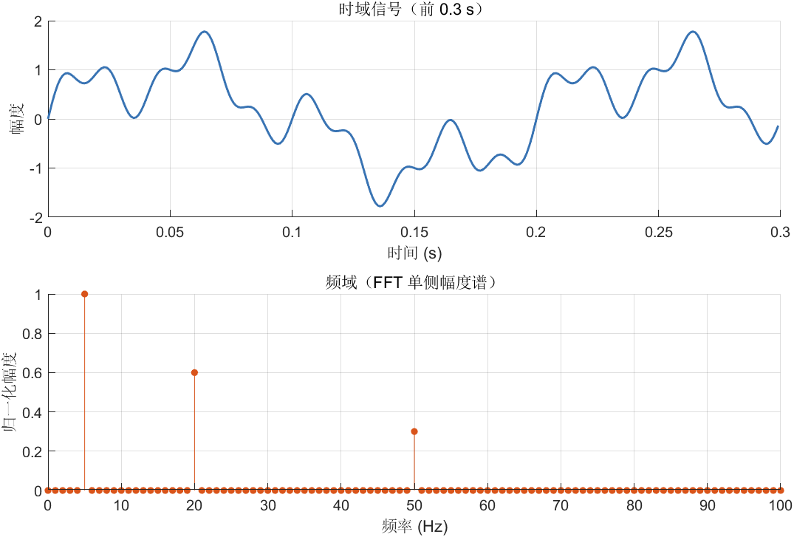
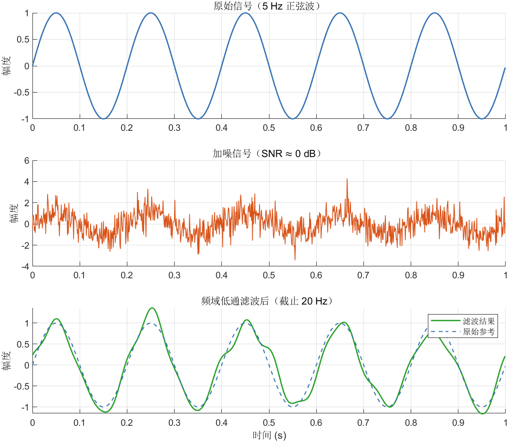
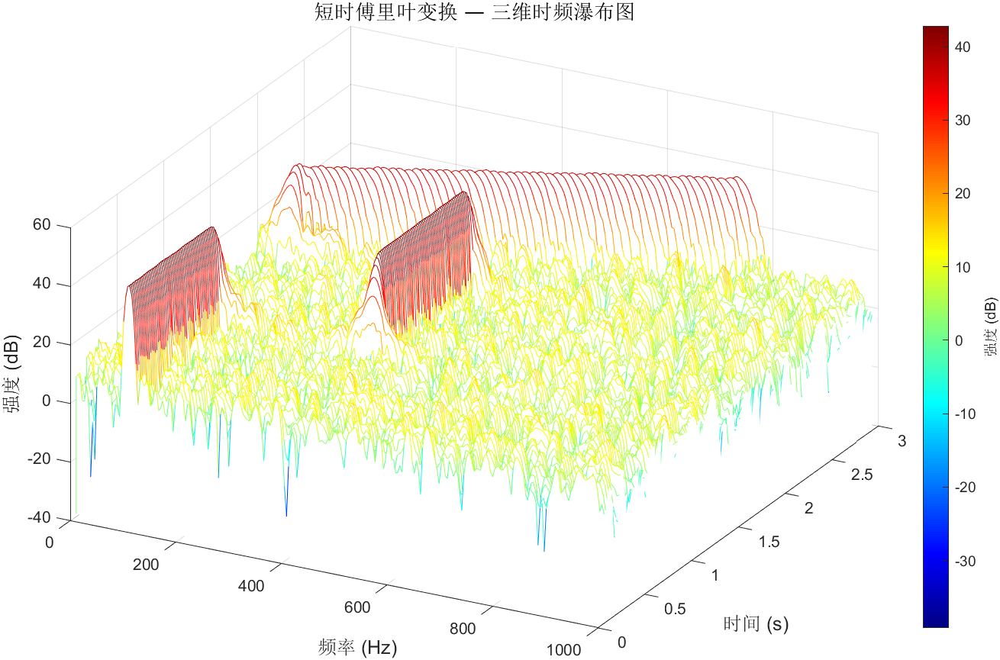

# Chapter 1 信号，特征与噪声


## 1.1 什么是信号

信号是表示消息的物理量，如电信号可以通过幅度、频率、相位的变化来表示不同的消息。这种电信号有模拟信号和数字信号两类。信号是运载消息的工具，是消息的载体。从广义上讲，它包含光信号、声信号和电信号等。按照实际用途区分，信号包括电视信号、广播信号、雷达信号，通信信号等；按照所具有的时间特性区分，则有确定性信号和随机性信号等。

简单来说，信号是传递信息的载体。载体可以是任何客观实体，声光电热任何物理量的**变化**都可以看作信号在传递。单个不变的严格来说物理量不能称作信号，这应该称作某个客观物体的属性。

通讯的双方通过**协议**确定信号如何传递信息。例如TCP/IP协议确定了TCP/IP协议包如何包装信息，传递信息。

要注意的是，信号是人为规定的，不存在天然的信号。

## 1.2 如何描述信号：比特/比特率/码元、波特/波特率。

在介绍比特之前，需要先区分两类信号的取值方式：

**离散信号（Digital Signal）**：取值是有限的、不连续的，可以用整数枚举。例如：

- 一排 LED 灯中亮着的数量（0、1、2…n 盏）
- 开关的状态（开 / 关）
- 骰子的点数（1 ~ 6）

**连续信号（Analog Signal）**：取值在某范围内连续变化，无法用有限个整数穷举。例如：

- 声音的响度
- 光照强度（照度）
- 温度

有些信号两种方式都可以描述，取决于精度需求。例如颜色：既可以用连续的光波长（380 ~ 780 nm）表示，也可以离散化为 256 级的 RGB 整数值。

这一区分在工程中非常关键——**数字系统只能处理离散信号**，所以模拟信号在进入计算机前必须经过**采样（Sampling）**，转换为离散值，这个过程不可避免地会损失部分信息。

介绍完两类信号后，再来看**比特（bit）**。比特是描述离散信号信息量的最小单位，只有两种取值：0 或 1。任何离散信号都可以用若干比特的组合来表示。

接下来介绍**码元**，区别于比特的0、1的固定，码元比较宽泛，码元可以通过进制（n进制）来简化比特的描述

例如：
比特（BIN）:0010 1101 0011 0110
码元（HEX）:2   D   3   6

**比特率**是单位时间内传输或处理的比特数量，单位为比特每秒（bps）,常用的单位是bps、kbps、Gbps...

要注意的是区别X**b**ps和X**B**ps的关系，中间差了8倍

波特/波特率 是一个稍微复杂一点但是极其重要的概念。

波特（Baud）是设备（如调制解调器）每秒钟**发生信号变化**的度量。它代表的是信号的变化，而不是传输数据的多少。这里尤其要注意，**波特不表示具体的信号内容，不描述信号本身传递的信息量。** 通讯的时候要保证通讯的双方必须要在同样的调制速度（波特）上，否则就不能通讯或会出现大量乱码。
先区分两个容易混淆的概念：

- **波特（Baud）** 是符号速率的单位，类似"米"之于距离
- **波特率（Baud Rate）** 是每秒发生信号变化的次数，单位就是波特，类似"米/秒"之于速度

两者是单位和量值的关系，日常使用中常混用，但严格来说"9600 波特"才是完整表达。

### 波特率与比特率的关系

波特率描述物理层每秒变化多少次，比特率描述每秒传递多少比特信息。两者通过每次变化能携带的信息量联系起来：

> **比特率 = 波特率 × log₂N**
>
> N 是信号每次变化时可取的状态数（调制阶数）

举例说明：

| 调制方式 | 状态数 N | 每符号比特数 | 波特率 1000 Baud 时的比特率 |
| ------- | ------- | ---------- | ------------------------ |
| 二进制（0/1） | 2 | 1 bit | 1000 bps |
| 四相调制（QPSK） | 4 | 2 bits | 2000 bps |
| 16-QAM | 16 | 4 bits | 4000 bps |
| 256-QAM | 256 | 8 bits | 8000 bps |

可以看到，**在不改变波特率（即不改变物理线路要求）的前提下，提高调制阶数就能成倍提升比特率**。这正是现代通信（WiFi、4G/5G、有线宽带）普遍采用高阶 QAM 的原因。

一个具体的历史例子：早期 56K 拨号调制解调器，电话线物理带宽限制波特率只有约 3200 Baud，但 V.90 协议通过高阶调制将实际比特率推到了约 56000 bps。

> **小结**：波特率是物理约束，比特率是信息目标。提升比特率有两条路：一是加快波特率（需要更好的传输介质）；二是提高每符号携带的比特数（采用更高阶的调制方式），代价是对信噪比的要求更高。

### 常用波特率

不同场景下有各自约定俗成的标准波特率，随意选取非标准值会导致双方无法通信。

**串口通信（UART/RS-232）** 是最常见的使用场景，标准波特率序列为：

> 300 → 1200 → 2400 → 4800 → **9600** → 19200 → 38400 → 57600 → **115200** → 230400 → 921600

其中 **9600** 和 **115200** 最为常见——9600 是许多嵌入式设备、工业仪表的默认值；115200 是现代开发板（Arduino、树莓派等）调试串口的主流选择。

这个序列并非随意排列，相邻两档大致成 2 倍关系，源于早期硬件用固定晶振分频产生波特率时的倍频特性。

**其他场景的常用波特率：**

| 场景 | 典型波特率 | 备注 |
| ---- | --------- | ---- |
| CAN 总线（汽车/工业） | 125k / 250k / 500k / 1M Baud | 距离越长，波特率越低 |
| SPI 总线 | 1M ~ 50M Baud | 取决于主控和外设支持 |
| I²C 总线 | 100k / 400k / 1M Baud | 标准 / 快速 / 高速模式 |
| 早期拨号调制解调器 | 300 / 1200 / 2400 Baud | 比特率靠高阶调制拉升 |

> **注意**：波特率必须由通讯双方提前约定好，没有自动协商机制（部分高层协议除外）。波特率不匹配时，接收方采样时序错乱，轻则乱码，重则完全无法解析数据。

---

## 1.3 什么是噪声

### 噪声的定义

噪声（Noise）是信号中**不携带有用信息的成分**，是一切妨碍我们从信号中提取目标信息的干扰项。

需要强调的是，噪声与信号的区分是**相对于目的而言的**，而非物理本质的区别。同一个物理量，在不同任务里身份截然不同：

| 场景 | "信号"是什么 | "噪声"是什么 |
| ---- | ----------- | ----------- |
| 语音识别 | 说话人的声音波形 | 环境背景噪声、麦克风电气噪声 |
| 地震监测 | 地震产生的地面震动 | 车辆行驶、风吹草动引起的微小振动 |
| 股票预测 | 基本面驱动的价格趋势 | 市场情绪引发的随机波动 |
| 医学影像 | 病灶区域的像素值差异 | 成像设备引入的随机颗粒感 |

> **关键认知**：噪声是"无用"的，不是"不存在"的。真实世界里，任何测量都混杂噪声。我们无法消灭噪声，只能尽量**分离信号与噪声**。

---

### 噪声的来源

噪声的来源可以分为两大类：

**外部噪声（Environmental Noise）**：来自被测系统之外的干扰

- 电磁干扰（EMI）：附近电机、变压器、手机等产生的电磁辐射
- 环境干扰：温度变化引起电阻值漂移，振动引起传感器读数抖动
- 其他信号串扰：相邻通道的信号"泄漏"进来

**内部噪声（Intrinsic Noise）**：来自测量/传输系统自身

- **热噪声（Thermal Noise / Johnson–Nyquist Noise）**：导体中电子随机热运动产生的电压波动，任何电阻在室温下都存在，**无法通过设计完全消除**
- **散粒噪声（Shot Noise）**：电荷载体通过势垒时因量子效应产生的随机涨落，常见于光电探测器
- **量化噪声（Quantization Noise）**：模拟信号被 ADC 采样量化时，因精度有限而引入的舍入误差

---

### 信噪比（SNR）

区分了信号和噪声，我们自然需要一个量来衡量"有用信号比噪声多多少"——这就是**信噪比（Signal-to-Noise Ratio, SNR）**。

$$\text{SNR} = \frac{P_{\text{signal}}}{P_{\text{noise}}}$$

其中 $P$ 表示功率（Power）。工程上更常用**对数形式（分贝 dB）**：

$$\text{SNR (dB)} = 10 \cdot \log_{10}\!\left(\frac{P_{\text{signal}}}{P_{\text{noise}}}\right)$$

几个典型参考值：

| SNR | 直观感受 |
| --- | ------- |
| 0 dB | 信号与噪声一样强，几乎无法区分 |
| 10 dB | 信号功率是噪声的 10 倍，勉强可用 |
| 20 dB | 信号功率是噪声的 100 倍，质量良好 |
| 40 dB | 信号功率是噪声的 10000 倍，高保真水准 |

> **CD 音质**的动态范围约 96 dB，**专业录音室**通常要求 SNR > 70 dB。

SNR 越高，从信号中提取信息越容易；反之，噪声过大时，后续的特征提取和模型训练都会受到严重干扰。**提升 SNR 是信号处理的核心目标之一。**

---

### 噪声的常见统计特性

为了对噪声建模和处理，工程上常假设噪声具有特定的统计分布。

**高斯白噪声（AWGN, Additive White Gaussian Noise）** 是最常见的噪声模型：

- **加性（Additive）**：噪声直接叠加在信号上，即 $y = x + n$
- **白色（White）**：噪声的功率在所有频率上均匀分布（类比白光包含所有颜色）
- **高斯（Gaussian）**：噪声幅度服从正态分布 $n \sim \mathcal{N}(0, \sigma^2)$

这个模型在数学上好处理，在物理上也有坚实依据（热噪声本质上就是 AWGN），因此被广泛用于通信系统分析和机器学习的数据增强。

其他常见噪声类型：

| 噪声类型 | 特点 | 典型场景 |
| ------- | ---- | ------- |
| 椒盐噪声（Salt-and-Pepper） | 随机像素突变为极大或极小值 | 图像传感器坏点、数字传输误码 |
| 周期性噪声 | 固定频率的干扰 | 工频（50/60 Hz）干扰进入音频 |
| 粉红噪声（1/f Noise） | 低频能量更强 | 电子器件老化、生物信号 |
| 脉冲噪声 | 短时高幅度尖峰 | 电火花、雷击、静电放电 |

---

### 滤波与降噪

既然噪声无法消灭，我们能做的就是**把它从信号中分离出去**。这个过程叫做**降噪（Denoising）**，最常用的手段是**滤波（Filtering）**。

**滤波**的核心思想是：信号和噪声往往占据不同的**频率范围**，通过只保留目标频段、抑制其他频段，就能在提高 SNR 的同时保留有用信息。

#### 四种基本滤波器

按照"放行哪段频率"来分类，有四种基础类型：

| 滤波器类型 | 放行频段 | 抑制频段 | 典型用途 |
| --------- | ------- | ------- | ------- |
| 低通滤波器（Low-Pass） | 低频 | 高频 | 去除高频噪声、音频平滑 |
| 高通滤波器（High-Pass） | 高频 | 低频 | 去除直流偏置、提取边缘 |
| 带通滤波器（Band-Pass） | 特定频段 | 频段外 | 无线通信选台、心电信号提取 |
| 带阻滤波器（Band-Stop / Notch） | 频段外 | 特定频段 | 消除工频干扰（50/60 Hz） |

一个直观的类比：低通滤波器就像一个"缓慢移动的均值"——它保留信号的整体趋势，削去快速抖动的毛刺。

#### 滤波的代价：截止频率的选择

滤波不是免费的。滤波器的**截止频率（Cutoff Frequency）** 决定了从哪里开始抑制，选错了会有两种后果：

- **截止频率太低**：把有用的高频信号成分也滤掉了，导致信号失真（过度平滑）
- **截止频率太高**：保留了大量噪声，降噪效果有限

因此，设置截止频率需要先了解目标信号和噪声各自的频率分布范围。

#### 常用降噪方法

除了频域滤波，实践中还有几类常用降噪手段：

**滑动平均（Moving Average）**：对时间窗口内的样本取均值，抑制随机高频波动。实现简单，但会引入延迟，不适合对实时性要求高的场景。

**中值滤波（Median Filter）**：取窗口内的中位数而非均值。对椒盐噪声（随机尖峰）特别有效，因为中位数对极端值不敏感，而均值会被极端值严重拉偏。

**卡尔曼滤波（Kalman Filter）**：利用系统的动态模型，对下一时刻的信号做预测，再结合实际测量值加权修正。适合有明确物理模型的场景（如导航、机器人定位），是工程中最强大的实时降噪工具之一。

**小波去噪（Wavelet Denoising）**：将信号做小波分解，噪声通常表现为小波系数中幅度较小的高频成分，通过阈值截断这些系数再重建信号，即可有效去噪，同时保留信号的突变特征（边缘、尖峰）。

> **小结**：选择降噪方法需要结合噪声类型和信号特性。没有万能的降噪算法——了解噪声的来源和统计特性，是选对工具的前提。

---

## 1.4 傅里叶变换（Fourier Transform）

### 核心思想：时域与频域

我们平时观察信号，看到的是**幅度随时间变化**的曲线，这是**时域（Time Domain）**视角。傅里叶变换提供了另一种视角——**频域（Frequency Domain）**：把信号"拆开"，看清它由哪些频率的正弦波组成，以及各自有多强。

> **傅里叶定理**：任何满足一定条件的信号，都可以分解为若干（有限或无限个）不同频率、不同幅度的正弦波之和。

```text
时域视角                         频域视角
幅度                             幅度
  │    ╭─╮   ╭─╮   ╭─╮           │  ▌
  │   ╭╯ ╰╮ ╭╯ ╰╮ ╭╯ ╰╮          │  ▌     ▌
  │  ╭╯   ╰─╯   ╰─╯   ╰╮         │  ▌     ▌        ▌
  │──╯                  ╰──       │──┴──┬──┴──┬─────┴──→ 频率
  └──────────────────────→ 时间      0   5Hz  20Hz   50Hz

         傅里叶变换 →
         ←  逆变换
```

两个视角描述的是**同一个信号**，只是观察角度不同。频域视角的优势在于：噪声与信号往往占据不同频段，在频域中它们一目了然，处理起来也更直接。

---

### 数学定义

#### 欧拉公式

傅里叶变换的数学基础是**欧拉公式**，它把指数函数与三角函数联系起来：

$$e^{j\theta} = \cos\theta + j\sin\theta$$

其中 $j = \sqrt{-1}$ 为虚数单位。几何意义：$e^{j\theta}$ 是复平面上单位圆上的一个点，角度为 $\theta$。当 $\theta$ 随时间线性增长（$\theta = 2\pi f t$），这个点就在以频率 $f$ 旋转——这正是正弦波的本质。

#### 连续傅里叶变换（CFT）

对连续信号 $x(t)$，其傅里叶变换 $X(f)$ 定义为：

$$X(f) = \int_{-\infty}^{+\infty} x(t)\, e^{-j2\pi ft}\, dt$$

逆变换（从频域还原时域）：

$$x(t) = \int_{-\infty}^{+\infty} X(f)\, e^{+j2\pi ft}\, df$$

$X(f)$ 是复数，其**模 $|X(f)|$** 表示频率 $f$ 处的幅度，**辐角 $\angle X(f)$** 表示该频率分量的相位。

#### 离散傅里叶变换（DFT）

计算机只能处理离散的有限序列。对长度为 $N$ 的离散信号 $x[n]$（$n = 0, 1, \ldots, N-1$），DFT 定义为：

$$X[k] = \sum_{n=0}^{N-1} x[n]\, e^{-j\frac{2\pi}{N}kn}, \quad k = 0, 1, \ldots, N-1$$

- $k$ 对应第 $k$ 个频率分量，实际频率为 $f_k = \dfrac{k \cdot f_s}{N}$（$f_s$ 为采样率）
- 输出 $X[k]$ 共 $N$ 个复数，前 $N/2$ 个对应 $0$ 到 $f_s/2$（奈奎斯特频率）的正频率分量

逆 DFT：

$$x[n] = \frac{1}{N}\sum_{k=0}^{N-1} X[k]\, e^{+j\frac{2\pi}{N}kn}$$

#### 快速傅里叶变换（FFT）

直接计算 DFT 需要 $O(N^2)$ 次运算，当 $N = 10^6$ 时完全不可用。**FFT** 是一族通过递归分治将计算量降至 $O(N \log N)$ 的算法（最常见的是 Cooley-Tukey 算法），使傅里叶分析在工程中真正实用。

| 方法 | 复杂度 | $N=10^6$ 时的运算量 |
| ---- | ------ | ------------------ |
| 直接 DFT | $O(N^2)$ | $10^{12}$ 次 |
| FFT | $O(N \log N)$ | $\approx 2 \times 10^7$ 次 |

> **实用建议**：在工程和机器学习中，几乎所有"傅里叶变换"指的都是 FFT，两者可以当作同义词。MATLAB 的 `fft(x)` 返回双侧完整频谱，实际使用只需取前 $N/2+1$ 点（正频率部分），再将幅度除以 $N/2$ 归一化。若需同时观察频率随时间的变化，使用 `spectrogram` 函数。

---

### 关键性质

| 性质 | 含义 | 实用价值 |
| ---- | ---- | ------- |
| 线性 | $\mathcal{F}\{ax+by\} = aX+bY$ | 叠加的信号，频谱也叠加 |
| 时移 | 时域平移 → 频域相位变化，幅度不变 | 识别信号延迟时只看幅度谱即可 |
| 卷积定理 | 时域卷积 ↔ 频域乘法 | 滤波器在频域只需做乘法，效率极高 |
| Parseval 定理 | 时域总能量 = 频域总能量 | 能量守恒，变换不丢失信息 |

**卷积定理**是滤波器与 FFT 结合的理论基础：在时域做卷积（滑动窗口运算）等价于在频域做逐点乘法，因此可以先 FFT、乘以滤波器的频率响应、再逆 FFT，大幅降低计算量。

---

### 代码示例与图像

#### 示例一：分解复合信号

```matlab
fs = 1000;                              % 采样率 1000 Hz
t  = (0:fs-1) / fs;                    % 1 秒，1000 个采样点

% 合成信号：5 Hz + 20 Hz + 50 Hz 三个正弦波叠加
x = sin(2*pi*5*t) + 0.6*sin(2*pi*20*t) + 0.3*sin(2*pi*50*t);

% FFT（单侧幅度谱）
N     = length(x);
X     = fft(x);
amp   = abs(X(1:N/2+1)) / (N/2);      % 归一化，直流项再除以 2
amp(1) = amp(1) / 2;
freqs = (0:N/2) * fs / N;             % 频率轴（Hz）

figure('Position', [100 100 800 500], 'Color', 'w');

subplot(2,1,1);
plot(t(1:300), x(1:300), 'LineWidth', 1.2);
xlabel('时间 (s)'); ylabel('幅度');
title('时域信号（前 0.3 s）'); grid on;

subplot(2,1,2);
stem(freqs, amp, 'filled', 'MarkerSize', 4);
xlabel('频率 (Hz)'); ylabel('归一化幅度');
title('频域（FFT 单侧幅度谱）');
xlim([0 100]); grid on;

saveas(gcf, 'fft_demo.png');
```



运行后，幅度谱在 5 Hz、20 Hz、50 Hz 处各出现一根尖峰，幅度分别为 1.0、0.6、0.3——与构造信号时写入的系数完全吻合。**频谱的尖峰就是信号的"指纹"**，一眼即可读出信号的频率组成。

---

#### 示例二：用 FFT 实现频域低通滤波

```matlab
rng(42);

fs    = 1000;
t     = (0:fs-1) / fs;
clean = sin(2*pi*5*t);                  % 目标信号：5 Hz
noise = 0.8 * randn(1, fs);             % 高斯白噪声
noisy = clean + noise;

% -------- 频域低通滤波 --------
N         = length(noisy);
X         = fft(noisy);
freqs_all = (0:N-1) * fs / N;          % 双侧频率轴
cutoff    = 20;                         % 截止频率（Hz）

X_filt = X;
mask = freqs_all > cutoff & freqs_all < (fs - cutoff);
X_filt(mask) = 0;                       % 零化高频系数
filtered = real(ifft(X_filt));          % 逆 FFT 还原时域
% ------------------------------

figure('Position', [100 100 800 680], 'Color', 'w');

subplot(3,1,1);
plot(t, clean, 'Color', [0.22 0.45 0.70], 'LineWidth', 1.2);
ylabel('幅度'); title('原始信号（5 Hz 正弦波）'); grid on;

subplot(3,1,2);
plot(t, noisy, 'Color', [0.85 0.33 0.10], 'LineWidth', 0.8);
ylabel('幅度'); title('加噪信号（SNR ≈ 0 dB）'); grid on;

subplot(3,1,3);
plot(t, filtered, 'Color', [0.17 0.63 0.17], 'LineWidth', 1.2); hold on;
plot(t, clean, '--', 'Color', [0.22 0.45 0.70], 'LineWidth', 1.0, ...
    'DisplayName', '原始参考');
xlabel('时间 (s)'); ylabel('幅度');
title('频域低通滤波后（截止 20 Hz）');
legend('滤波结果','原始参考'); grid on;

saveas(gcf, 'fft_filter_demo.png');
```



频域滤波的完整流程：

```text
加噪信号
  ↓  FFT（时域 → 频域）
频域系数 X[k]
  ↓  将高于截止频率的系数置零（低通滤波器）
滤波后的频域系数
  ↓  逆 FFT（频域 → 时域）
滤波后的信号
```

得益于卷积定理，整个过程只有三步：FFT → 逐点相乘滤波器响应 → 逆 FFT，计算效率远高于时域卷积。

---

#### 示例三：三维时频瀑布图（Waterfall Spectrogram）

单次 FFT 只能反映**整段信号**的频率组成，无法看到频率**随时间的变化**。短时傅里叶变换（STFT）将信号切成若干重叠窗，对每个窗做 FFT，叠成三维图：**X 轴频率、Y 轴时间、Z 轴强度（dB）**。

下面用一个频率随时间扫描的啁啾信号（Chirp）来演示——它的三维图上会呈现一条清晰的斜脊。

```matlab
fs  = 4000;                             % 采样率 4000 Hz
T   = 3;                                % 总时长 3 秒
t   = (0 : 1/fs : T - 1/fs);

% 构造三段拼接信号：
%   0~1 s  : 100 Hz 正弦波
%   1~2 s  : 400 Hz 正弦波
%   2~3 s  : 线性啁啾，从 50 Hz 扫到 800 Hz
seg1 = sin(2*pi*100  * t(t <  1));
seg2 = sin(2*pi*400  * t(t >= 1 & t < 2));
seg3 = chirp(t(t >= 2) - 2, 50, 1, 800);   % 相对时间归零
x    = [seg1, seg2, seg3] + 0.15*randn(1, length(t));

% STFT 参数
win_len = 512;
overlap = 448;                          % 重叠 = win_len × 7/8，时间分辨率更高
nfft    = 1024;

[S, F, Tv] = spectrogram(x, hamming(win_len), overlap, nfft, fs);
Z = 20*log10(abs(S) + eps);            % 转为 dB，eps 防止 log(0)

% -------- 绘制三维瀑布图 --------
figure('Position', [100 100 960 620], 'Color', 'w');
waterfall(F, Tv, Z');                  % Z' : 行=时间，列=频率
xlabel('频率 (Hz)', 'FontSize', 12);
ylabel('时间 (s)',  'FontSize', 12);
zlabel('强度 (dB)', 'FontSize', 12);
title('短时傅里叶变换 — 三维时频瀑布图 (STFT Waterfall)', 'FontSize', 13);
colormap(jet);
colorbar;
xlim([0 fs/2]);
view(30, 38);                          % 俯仰角，可自行调整
grid on;

saveas(gcf, 'fft_waterfall_3d.png');
```



图中三段信号的特征一目了然：

| 时间段 | 信号 | 瀑布图表现 |
| ------ | ---- | --------- |
| 0 ~ 1 s | 100 Hz 正弦波 | 100 Hz 处一条水平亮脊 |
| 1 ~ 2 s | 400 Hz 正弦波 | 400 Hz 处一条水平亮脊 |
| 2 ~ 3 s | 50→800 Hz 啁啾 | 从低频到高频斜向上的亮脊 |

这种图在工程中又称**声谱图（Spectrogram）**，是语音识别、音乐分析、雷达信号处理中最常用的可视化工具之一。

---

### 傅里叶变换与本章概念的联系

傅里叶变换是理解滤波、噪声处理和频域特征的**共同底层工具**：

- **对应 1.3 噪声**：噪声在频域往往呈宽频分布，而有用信号集中在特定频段；FFT 让这个差异可见、可操作
- **对应 1.3 滤波**：频域滤波的实质就是"选择性地保留 FFT 系数"，再逆变换回时域
- **对应 1.5 特征**：频谱（Spectrum）、MFCC、频谱质心等频域特征，都是直接从 FFT 结果中计算出来的

---

## 1.5 什么是特征

### 从信号到特征

原始信号往往是时间序列、图像矩阵、音频波形等**高维、冗余**的数据形式。直接把原始信号喂给机器学习模型，既低效又难以收敛。**特征（Feature）** 就是从原始信号中提炼出来的、对目标任务**最具判别力的描述量**。

一个类比：

> 你要判断一个人是否生病，不需要分析他身体里每一个细胞——你只需要体温、心率、血压等**关键指标**。这些指标就是从"人体信号"中提取出来的**特征**。

特征是信号的**压缩表示**，好的特征应该满足：

- **信息量大**：保留了对任务有用的变化，丢掉了无关波动（噪声）
- **维度适中**：足够描述问题，但不要冗余
- **可度量**：能被量化为数值

---

### 特征的分类

**时域特征（Time-Domain Features）**：直接在时间轴上计算，计算开销小

| 特征 | 含义 | 典型用途 |
| ---- | ---- | ------- |
| 均值（Mean） | 信号的平均水平 | 去偏置、基线检测 |
| 方差/标准差（Variance/Std） | 信号的波动幅度 | 活跃度判断、异常检测 |
| 峰峰值（Peak-to-Peak） | 最大值与最小值之差 | 振动强度、音量范围 |
| 均方根（RMS） | 信号的有效值 | 功率估计、音量感知响度 |
| 过零率（Zero-Crossing Rate） | 单位时间内信号穿过零点的次数 | 语音/静音检测、音调粗估 |
| 自相关（Autocorrelation） | 信号与自身时移版本的相似度 | 周期检测、基频估计 |

**频域特征（Frequency-Domain Features）**：通过傅里叶变换（FFT）将信号转换到频率轴后计算

> **核心思想**：任何复杂信号都可以分解为若干正弦波的叠加（傅里叶定理）。频域特征描述了信号的"频率成分结构"。

| 特征 | 含义 | 典型用途 |
| ---- | ---- | ------- |
| 频谱（Spectrum） | 各频率成分的幅度分布 | 声纹识别、故障诊断 |
| 主频（Dominant Frequency） | 能量最集中的频率 | 转速检测、音调识别 |
| 频谱质心（Spectral Centroid） | 频率分量的"重心" | 音色描述 |
| 频带能量比（Band Energy Ratio） | 特定频段内的能量占比 | 噪声滤波效果评估 |
| MFCC（梅尔倒谱系数） | 模拟人耳感知的频率特征 | 语音识别的标准特征 |

**时频域特征（Time-Frequency Features）**：同时刻画信号在时间和频率上的分布

- **短时傅里叶变换（STFT）**：将信号切成短窗，每个窗做 FFT，得到"频谱随时间变化"的二维图（声谱图）
- **小波变换（Wavelet Transform）**：用不同尺度的小波分析信号，对非平稳信号（如心电图、地震波）效果更好

---

### 特征工程：从信号到可用特征的过程

特征不会凭空出现，需要经过一系列处理步骤，这个过程称为**特征工程（Feature Engineering）**。

```text
原始信号
    ↓ 预处理（去噪、归一化、重采样）
清洁信号
    ↓ 特征提取（计算时域/频域指标、变换）
原始特征集
    ↓ 特征选择（去除冗余/无关特征）
最终特征向量
    ↓ 输入模型
预测结果
```

**预处理常见操作：**

- **去噪**：滤波器（低通/高通/带通滤波）、小波去噪、滑动平均
- **归一化**：将特征值缩放到统一范围（如 [0, 1] 或零均值单位方差），避免量纲差异影响模型
- **重采样**：统一不同来源信号的采样频率

**特征选择常用方法：**

- 方差过滤：删除方差接近 0 的特征（变化太小，对模型无贡献）
- 相关性分析：删除与目标变量无关或特征间高度冗余的维度
- 主成分分析（PCA）：将高维特征压缩为少数几个正交主成分

---

### 特征、信号与噪声的关系

三个概念相互关联，共同构成了信息处理的完整链条：

```text
真实世界
    ↓ 传感器/测量
原始信号 = 有用信号 + 噪声
    ↓ 去噪处理（提高 SNR）
清洁信号
    ↓ 特征提取
特征向量（高信息密度、低维度的信号压缩表示）
    ↓ 机器学习模型
决策 / 预测
```

> **一个直观的类比**：
> - **信号** 是一份完整的病历档案，包含所有检测数据
> - **噪声** 是档案里的记录错误、仪器漂移、偶然异常值
> - **特征** 是医生从档案里提炼出的关键指标（体温、血象、影像特征），用于做出诊断

特征工程的本质，就是**在去除噪声的同时，最大化保留对任务有用的信号成分**。

---

## 1.6 本章小结

| 概念 | 核心定义 | 关键量/工具 |
| ---- | ------- | ---------- |
| 信号 | 传递信息的物理量变化，由协议赋予含义 | 比特、波特率 |
| 噪声 | 信号中不携带有用信息的成分，定义依赖于任务目标 | 信噪比 SNR（dB） |
| 滤波 | 按频率选择性地保留或抑制信号成分，以提升 SNR | 截止频率、低通/高通/带通/带阻 |
| 傅里叶变换 | 将信号从时域转换到频域，揭示其频率组成 | FFT（`numpy.fft.rfft`） |
| 特征 | 从原始信号中提炼的、对任务最具判别力的描述量 | 时域/频域指标 |

各概念的递进关系：信号是原材料，噪声是杂质，傅里叶变换是"显微镜"（让噪声和信号在频域无所遁形），滤波是"过滤器"（在频域分离两者），特征是最终提炼出的精华。信号处理和机器学习的大量工作，都是在这个框架下进行的。
