# Chapter 2 电子电路中的电信号与空气中的电磁波


## 2.1 电信号的基本描述量与调制

在正式进入电路物理层的讨论之前，我们需要先建立一套**描述语言**——无论面对任何电信号，工程师都用同一套参数来"读懂"它。这一节的任务就是建立这套语言。

电信号在形态上可以分为两大类，两者的描述方式既有重叠又各有侧重：

- **连续波信号（Continuous Wave, CW）**：在时间轴上持续振荡的信号，正弦波是其最典型的代表
- **脉冲信号（Pulse Signal）**：在时间轴上短暂出现的突变，数字信号的基本单元

---

### 2.1.1 基本描述量

#### 一、连续波信号的描述量

连续波信号最典型的形式是**正弦波**：

$$x(t) = A \cdot \sin(2\pi f t + \varphi)$$

这一个方程里，包含了描述连续波信号所需的全部核心参数。

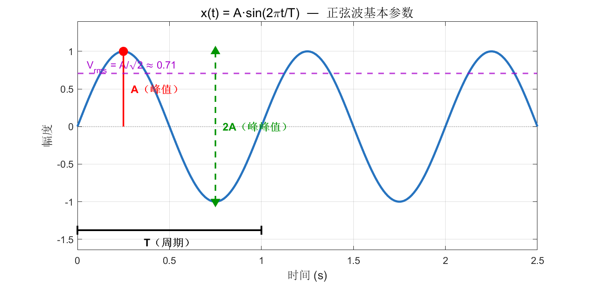

---

**① 幅度（Amplitude）**

幅度描述信号的"强弱"，但"幅度"这个词在不同场合有三种不同的精确含义，务必区分：

| 名称                            | 符号             | 定义                                                         | 适用场合               |
| ------------------------------- | ---------------- | ------------------------------------------------------------ | ---------------------- |
| 峰值（Peak）                    | $A$ 或 $V_p$ | 信号偏离零点的最大值                                         | 描述最大摆幅，防止过载 |
| 峰峰值（Peak-to-Peak）          | $V_{pp}$       | 最高点到最低点的总差值，$V_{pp} = 2A$（纯正弦）            | 示波器直接读数，最直观 |
| 有效值（RMS, Root Mean Square） | $V_{rms}$      | 与信号功率等效的直流电压，$V_{rms} = A/\sqrt{2}$（纯正弦） | 功率计算，电气安全标准 |

> **为什么需要 RMS？** 功率 $P = V^2/R$，对于交变信号，瞬时功率随时间变化。RMS 是让"等效直流"产生相同平均功率的值。家用 220 V 交流电，指的正是其 RMS 值；其峰值实为 $220\sqrt{2} \approx 311\ \text{V}$。

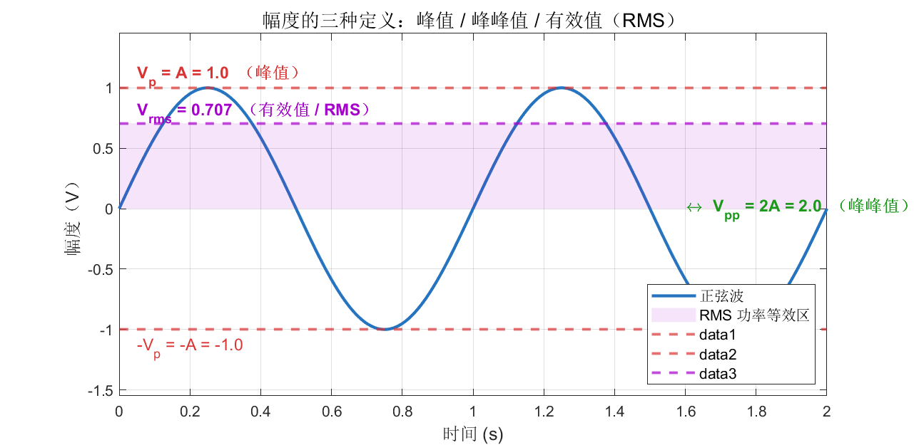

---

**② 频率（Frequency）与周期（Period）**

$$f = \frac{1}{T}$$

- **周期 $T$**：信号完成一次完整振荡所需的时间，单位秒（s）
- **频率 $f$**：每秒振荡的次数，单位赫兹（Hz）

两者互为倒数，描述同一件事的两个角度。工程中频率更常用，因为它直接对应频谱上的位置。

常见频率范围参考：

| 频率范围          | 典型信号                                   |
| ----------------- | ------------------------------------------ |
| 1 Hz ~ 100 Hz     | 工频（50/60 Hz）、生物电信号（脑电、心电） |
| 100 Hz ~ 100 kHz  | 音频信号、低速传感器                       |
| 100 kHz ~ 100 MHz | 中频通信、AM/FM 广播、MCU 时钟             |
| 100 MHz ~ 10 GHz  | 高速数字信号、WiFi、蓝牙、4G/5G            |

---

**③ 相位（Phase）**

$$x(t) = A \cdot \sin(2\pi f t + \varphi)$$

相位 $\varphi$ 描述信号在时间轴上的"起始位置"。对单个信号而言，绝对相位没有意义——它总可以通过选取时间原点来调整。相位真正有意义的地方是**两个同频信号之间的相对关系**：

```text
信号 A：sin(2πft)
信号 B：sin(2πft + π/2)

→ B 比 A 超前 90°（即超前 T/4 的时间）
```

相位差在以下场景中至关重要：

- **差分信号传输**（如 RS-485、LVDS）：两路信号相位相差 180°，接收端做差消除共模噪声
- **I/Q 调制**：正交的两路信号（相差 90°）携带独立信息，是现代无线通信的核心
- **相控阵天线**：通过控制各阵元信号的相位差，实现波束的电子扫描

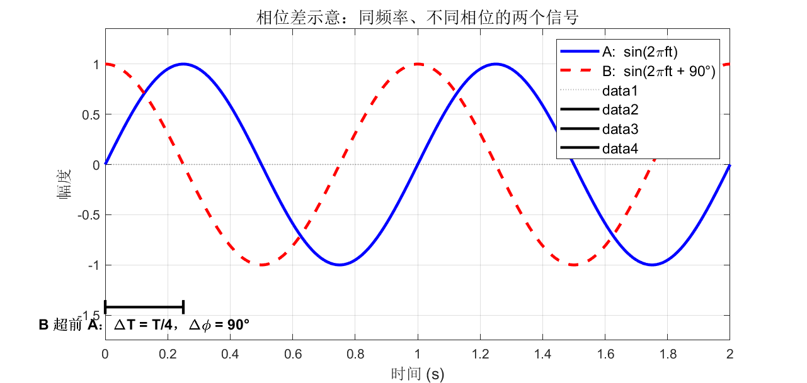

---

**④ 波长（Wavelength）**

波长描述信号在传输介质中**一个周期内传播的空间距离**：

$$\lambda = \frac{v_p}{f}$$

其中 $v_p$ 是信号在介质中的**相速度**（Phase Velocity）。在真空中电磁波以光速 $c \approx 3 \times 10^8\ \text{m/s}$ 传播，而在 PCB 走线（微带线）中，由于基材介电常数（通常 $\varepsilon_r \approx 4$）的影响：

$$v_p = \frac{c}{\sqrt{\varepsilon_{eff}}} \approx 0.5c \sim 0.7c$$

**波长何时重要？**

当走线长度 $l$ 与波长 $\lambda$ 相比**不可忽略**时，信号就不再是"瞬时传遍"的集总参数，而是要当作分布式传输线处理。经验规则：

$$l > \frac{\lambda}{10} \quad \Rightarrow \quad \text{必须考虑传输线效应}$$

| 信号频率 | PCB 中波长（$v_p \approx 0.6c$） | $\lambda/10$ |
| -------- | ---------------------------------- | -------------- |
| 100 MHz  | 180 cm                             | 18 cm          |
| 1 GHz    | 18 cm                              | 1.8 cm         |
| 5 GHz    | 3.6 cm                             | 3.6 mm         |

> 一块手掌大小的 PCB 上，5 GHz 的 WiFi 信号走线稍长就必须按传输线设计——波长已经和走线长度同一量级。

---

**⑤ 包络（Envelope）**

当一个**高频载波**的幅度被**低频信号**调制时，包络就是那条"描绘幅度变化轮廓"的慢变曲线：

包络的数学定义是信号的**瞬时幅度**，通过希尔伯特变换可以精确提取。直觉上，包络就是用一根橡皮筋"套住"载波波形的外轮廓。

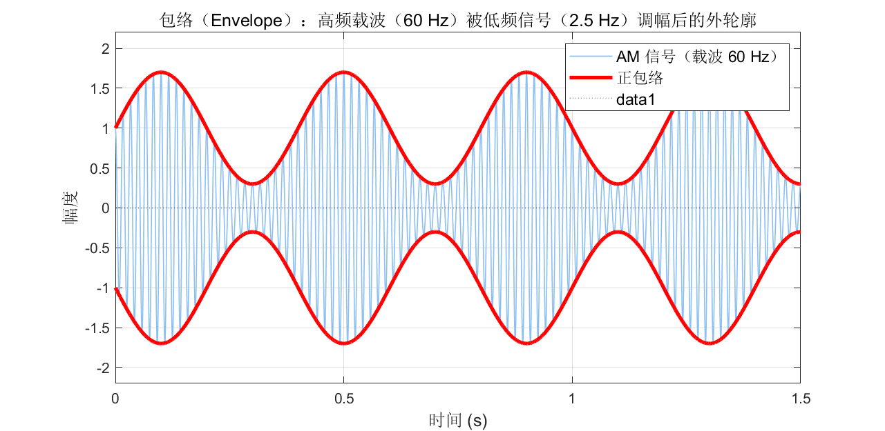

包络的概念在以下场景直接出现：

- **AM 解调**：包络检波器直接提取包络，还原音频信号
- **雷达脉冲**：脉冲包络的形状决定距离分辨率
- **信号质量评估**：包络起伏（幅度调制寄生）是电路设计缺陷的症状之一

---

**⑥ 直流分量与交流分量**

任何真实信号都可以分解为：

$$x(t) = \underbrace{X_{DC}}_{\text{直流分量（均值）}} + \underbrace{x_{AC}(t)}_{\text{交流分量（波动）}}$$

- **直流分量（DC）**：信号的时间平均值，在频域对应 0 Hz 处的分量
- **交流分量（AC）**：信号围绕均值的波动，携带实际信息

**DC offset 的实际意义：**

在电路中，DC 偏置往往不是"信号"的一部分，而是电路工作点的需要（如运放偏置、ADC 参考电压）。不加处理地叠加在有用信号上会：

- 浪费 ADC 的动态范围
- 带来不必要的功耗
- 在交流耦合电路中直接被滤掉

工程中常用**隔直电容（AC coupling capacitor）**去除 DC 分量，只让 AC 分量通过。

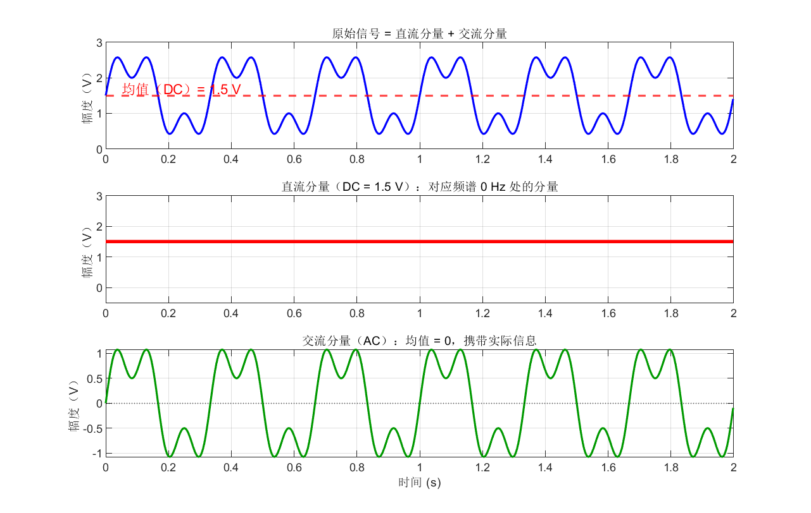

---

**⑦ 带宽（Bandwidth）**

带宽描述信号**占据的频率范围**，单位 Hz：

$$BW = f_{high} - f_{low}$$

带宽是信号的一个固有属性，**不是越大越好也不是越小越好**，而是必须与信道容量、采样率等匹配：

- 带宽过窄：高频成分被截断，信号失真（如方波变成圆弧）
- 带宽过宽：引入不必要的噪声（噪声功率 ∝ 带宽）

> 香农定理给出了带宽与信道容量的关系：$C = B \log_2(1 + \text{SNR})$，带宽和信噪比共同决定了信道的信息承载上限。

---

#### 二、脉冲信号的描述量

脉冲信号是数字世界的基石。一个理想的矩形脉冲看起来简单，但精确描述它需要一套专门的参数。

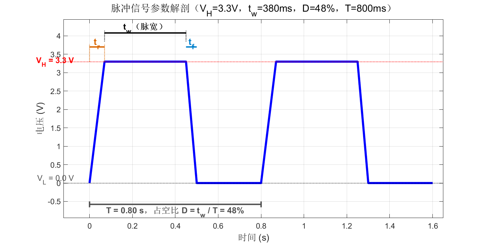

---

**① 高/低电平（Logic High / Low）**

脉冲信号的幅度不用峰值描述，而是用两个稳态电平：

| 参数     | 符号          | 含义                                    |
| -------- | ------------- | --------------------------------------- |
| 高电平   | $V_H$       | 逻辑"1"对应的电压，如 3.3 V、5 V、1.8 V |
| 低电平   | $V_L$       | 逻辑"0"对应的电压，通常为 0 V（GND）    |
| 逻辑摆幅 | $V_H - V_L$ | 信号的总幅度变化                        |

不同逻辑族（TTL、CMOS、LVDS）有各自规定的高低电平阈值，这是系统互联时必须核对的参数。

---

**② 脉宽（Pulse Width, $t_w$）**

脉冲保持高电平的持续时间，通常在信号幅度 50% 处测量（即从上升沿 50% 到下降沿 50%）。脉宽直接决定：

- 数字通信中每个比特的持续时间（= 1/波特率）
- 雷达中脉冲压缩比和距离分辨率的权衡
- PWM 信号中输出功率的控制（占空比 = $t_w / T$）

---

**③ 周期与占空比（Period & Duty Cycle）**

$$T = \frac{1}{f_{rep}}, \quad D = \frac{t_w}{T} \times 100\%$$

- **重复频率（PRF, Pulse Repetition Frequency）**：每秒发送的脉冲数，$f_{rep} = 1/T$
- **占空比（Duty Cycle）**：高电平时间占整个周期的比例

占空比在功率控制中极其重要：电机驱动、LED 调光、开关电源均通过调节占空比来控制平均功率输出。

---

**④ 上升时间与下降时间（Rise Time & Fall Time）**

$$t_r = \text{信号从 } 10\% V_H \text{ 上升到 } 90\% V_H \text{ 所需时间}$$

$$t_f = \text{信号从 } 90\% V_H \text{ 下降到 } 10\% V_H \text{ 所需时间}$$

上升时间是衡量数字信号"陡峭程度"的核心参数，它与信号带宽之间有一个极其实用的经验公式：

$$\boxed{BW \approx \frac{0.35}{t_r}}$$

这意味着：**上升时间越短，信号所需的带宽越大**。一个上升时间为 1 ns 的信号，其有效带宽约为 350 MHz——这要求示波器探头、PCB 走线、连接器都必须支持这个带宽，否则波形将严重失真。

| 上升时间 | 有效带宽 | 典型场景             |
| -------- | -------- | -------------------- |
| 10 ns    | 35 MHz   | 低速 UART、I²C      |
| 1 ns     | 350 MHz  | USB 2.0、以太网      |
| 100 ps   | 3.5 GHz  | PCIe、高速 SerDes    |
| 10 ps    | 35 GHz   | 毫米波通信、高速测试 |

> **工程陷阱**：信号上升时间越快，越容易产生电磁辐射（EMI）。高速数字系统往往在驱动器端故意加电阻或增加上升时间，在不影响功能的前提下压制 EMI。

---

### 2.1.2 两类信号形态对比

理解了各自的描述量后，将两类信号放在一起对比，差异立刻清晰：

| 维度     | 连续波信号（CW）         | 脉冲信号（Pulse）          |
| -------- | ------------------------ | -------------------------- |
| 时域形态 | 持续振荡的正弦波         | 有限时长的矩形突变         |
| 能量分布 | 集中在单一频率（或窄带） | 分散在宽频带               |
| 频域形态 | 单根谱线（理想正弦）     | sinc 函数形状的宽谱        |
| 关键参数 | 频率、幅度、相位         | 脉宽、占空比、上升时间     |
| 典型应用 | 载波、本振、测试信号     | 数字通信、雷达、PWM        |
| 抗噪能力 | 频率调制（FM）时较强     | 取决于电平裕量（噪声容限） |

**频域展开的本质差异**是两者最深刻的区别：

- **理想正弦波**的频谱是单根冲激函数（delta function）——所有能量集中在一个频点
- **理想矩形脉冲**的频谱是 sinc 函数：$X(f) = t_w \cdot \text{sinc}(f \cdot t_w)$，能量从直流延伸到很高的频率，第一零点在 $f = 1/t_w$

这一特性解释了为什么高速数字电路会产生丰富的谐波辐射：一个 100 MHz 的时钟信号，其能量分布在 100 MHz、300 MHz、500 MHz……每一个奇次谐波上，这是 EMC（电磁兼容）设计必须面对的挑战。

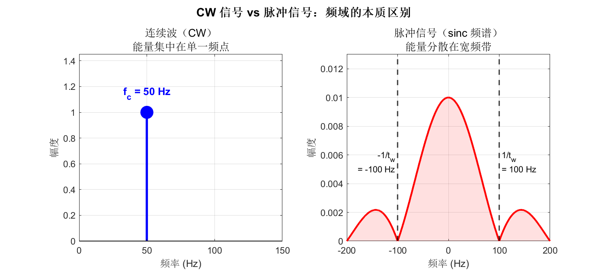

---

### 2.1.3 时域与频域分析

同一个信号，有两种完全等价但互补的观察视角：

**时域（Time Domain）**：横轴是时间，纵轴是幅度。这是示波器呈现的视图，直接反映信号随时间的演变过程，适合观察：

- 波形形状、上升/下降沿
- 定时关系（相位差、传播延迟）
- 偶发毛刺、过冲、振铃

**频域（Frequency Domain）**：横轴是频率，纵轴是各频率分量的幅度（或功率）。这是频谱仪（Spectrum Analyzer）呈现的视图，直接反映信号的频率组成，适合观察：

- 载波频率、谐波、杂散
- 噪声底噪（Noise Floor）
- 信道占用带宽

两者通过**傅里叶变换**（已在 Chapter 1.4 详细介绍）相互转换，描述的是**同一个物理信号的两张地图**。

#### 两种视角各自的优势

| 分析目标               | 推荐视角    | 原因                           |
| ---------------------- | ----------- | ------------------------------ |
| 查看信号波形形状       | 时域        | 直接可读                       |
| 测量上升时间、脉宽     | 时域        | 时间分辨率高                   |
| 定位谐波、杂散辐射     | 频域        | 频率分辨率高                   |
| 评估噪声类型           | 频域        | 白噪声、粉噪特征在频域一目了然 |
| 分析调制信号           | 频域        | 调制边带直接可见               |
| 检测定时抖动（Jitter） | 时域 + 统计 | 需要叠加多次波形（眼图）       |

#### 测量工具的对应

- **示波器（Oscilloscope）**：时域测量的核心工具，带宽决定能观察的最高频率，采样率决定时间分辨率
- **频谱仪（Spectrum Analyzer）**：频域测量的核心工具，分辨率带宽（RBW）决定频率分辨能力，本质上是一台扫频接收机或通过 FFT 计算频谱的仪器
- **矢量网络分析仪（VNA）**：同时测量幅度和相位的频域仪器，用于表征元器件、天线、传输线的频率响应

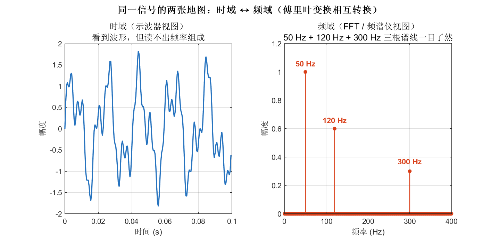

---

### 2.1.4 调制（Modulation）

#### 为什么需要调制

低频信号（如音频，20 Hz ~ 20 kHz）无法直接通过天线高效辐射——天线尺寸需要与波长匹配，20 kHz 信号的波长长达 15 km，这样的天线显然不可实现。

**调制**的本质是：将携带信息的**低频基带信号**，"搬运"到适合传输的**高频载波**上。载波就像一辆卡车，基带信号是货物——卡车跑得快、跑得远，货物被搭载着到达目的地后再卸下来（解调）。

$$\text{调制信号} = \text{基带信号} \times \text{载波}$$

---

#### AM — 幅度调制（Amplitude Modulation）

AM 将信息编码在载波的**幅度变化**中：

$$x_{AM}(t) = \left[1 + m \cdot s(t)\right] \cdot A_c \cos(2\pi f_c t)$$

其中 $s(t)$ 是归一化基带信号，$m$ 是调制指数（$0 < m \leq 1$），$f_c$ 是载波频率。

**直觉理解**：把正弦载波的"高低起伏"按基带信号的形状"捏"大捏小，包络的形状就是原始信息。

**频域特征**：AM 信号的频谱在载波 $f_c$ 两侧各出现一对**边带（Sideband）**，边带间距等于基带信号带宽。

**优点**：解调电路极简（包络检波，一个二极管+电容即可）

**缺点**：幅度容易受信道衰减和噪声影响，抗噪能力差；载波本身携带大量功率但不含信息（功率效率低）

**典型应用**：中波/短波广播（AM 广播，535 kHz ~ 1605 kHz）、航空通话（VHF AM）

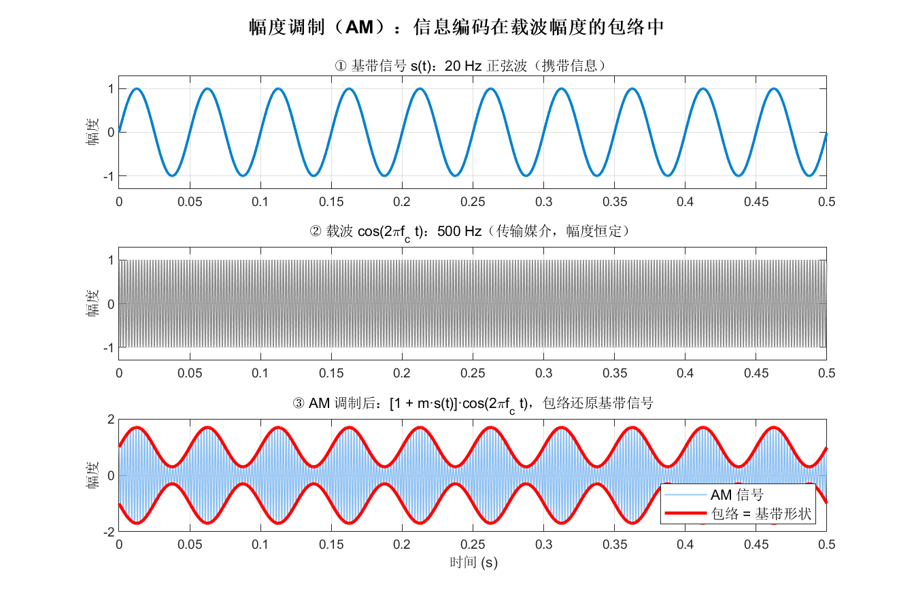

---

#### FM — 频率调制（Frequency Modulation）

FM 将信息编码在载波的**瞬时频率偏移**中：

$$x_{FM}(t) = A_c \cos\!\left(2\pi f_c t + 2\pi k_f \int_0^t s(\tau)\, d\tau\right)$$

其中 $k_f$ 是频率灵敏度（Hz/V），瞬时频率为 $f_i(t) = f_c + k_f \cdot s(t)$。

**直觉理解**：信号强时载波"振动得更快"，信号弱时"振动得更慢"，幅度始终不变。

**为什么 FM 比 AM 抗噪声更强？**

噪声主要表现为幅度的随机波动。FM 的信息在频率里，解调器（鉴频器）只关心频率变化，对幅度波动"天然免疫"——接收端可以先做限幅处理，把幅度噪声统统削掉，再提取频率信息。这一特性称为 **FM 的捕获效应（Capture Effect）**。

**代价**：FM 占用的带宽远大于 AM（由 Carson 带宽公式给出：$BW_{FM} \approx 2(\Delta f + f_{max})$），频谱效率较低。

**典型应用**：FM 广播（88 ~ 108 MHz）、模拟对讲机、早期模拟蜂窝网络（AMPS）

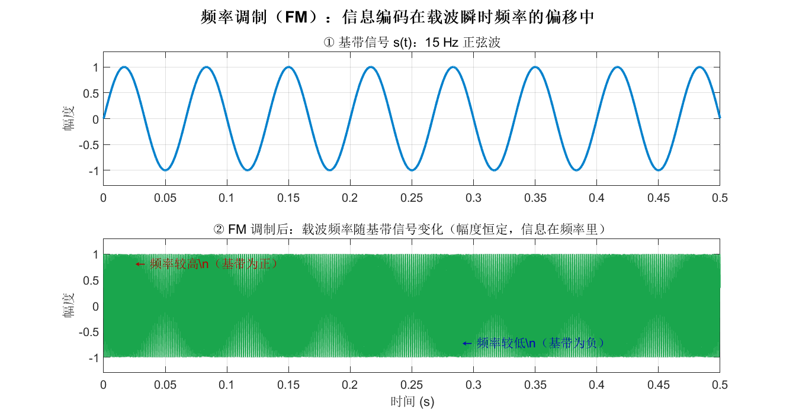

---

#### PM — 相位调制（Phase Modulation）

PM 将信息编码在载波的**瞬时相位**中：

$$x_{PM}(t) = A_c \cos\!\left(2\pi f_c t + k_p \cdot s(t)\right)$$

**PM 与 FM 的关系**：两者数学上密切相关——对基带信号积分后做 PM，等价于 FM；对基带信号微分后做 FM，等价于 PM。数字通信中大量使用的 PSK（Phase Shift Keying，相移键控）正是 PM 的离散版本：

| 调制方式 | 状态数                    | 每符号比特数 | 典型应用                |
| -------- | ------------------------- | ------------ | ----------------------- |
| BPSK     | 2（0°/180°）            | 1 bit        | 深空通信、GPS 导航码    |
| QPSK     | 4（0°/90°/180°/270°） | 2 bits       | 卫星通信、LTE 控制信道  |
| 16-QAM   | 16（幅度+相位联合调制）   | 4 bits       | WiFi、4G 数据信道       |
| 256-QAM  | 256                       | 8 bits       | WiFi 6、5G NR、有线电视 |

> QAM（正交幅度调制）是 AM 和 PM 的结合——在两个正交载波（相差 90°的同频正弦波）上分别做 AM，实现幅度和相位的联合调制，是现代高速无线通信的核心调制方式。

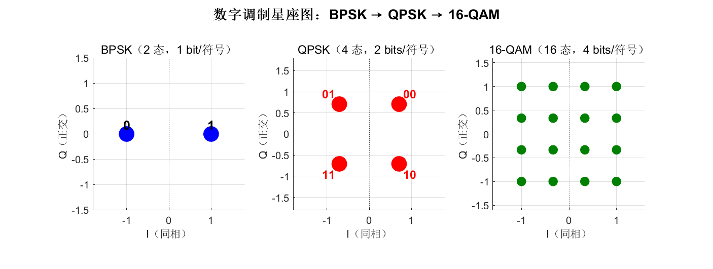

---

#### 寄生调制（Parasitic Modulation）

前三种调制都是**有意为之**的，而寄生调制是电路中**无意产生的调制**，是噪声的一种特殊形式，也是工程师需要排查的故障来源。

**本质**：某个不相关的物理量（电源电压、温度、振动）通过寄生耦合路径，意外地调制了目标信号。

常见的寄生调制类型：

| 类型                 | 来源                             | 现象                    | 频域特征                         |
| -------------------- | -------------------------------- | ----------------------- | -------------------------------- |
| 电源调制（AM 寄生）  | DC-DC 开关纹波耦合进射频信号     | 载波幅度随电源纹波起伏  | 载波两侧出现与纹波频率对应的边带 |
| 温漂调制（FM 寄生）  | 晶振频率随温度漂移               | 载波频率缓慢偏移        | 频谱谱线展宽或游移               |
| 相位噪声（PM 寄生）  | 振荡器内部噪声调制相位           | 载波谱线"展宽"成裙摆形  | 载波附近出现连续噪声基底         |
| 振动调制（微音效应） | 机械振动改变电容值，频率调制载波 | 语音/振动频率出现在边带 | 载波两侧出现振动频率的边带       |

**排查方法**：

```text
怀疑有寄生调制？
    ↓
用频谱仪观察载波附近是否有"意外边带"
    ↓
边带频率是什么？
    ├→ 等于电源开关频率（如 300 kHz）→ 电源纹波耦合
    ├→ 等于风扇/电机转速 → 机械振动（微音效应）
    └→ 随温度变化漂移 → 温漂，检查晶振温度补偿
```

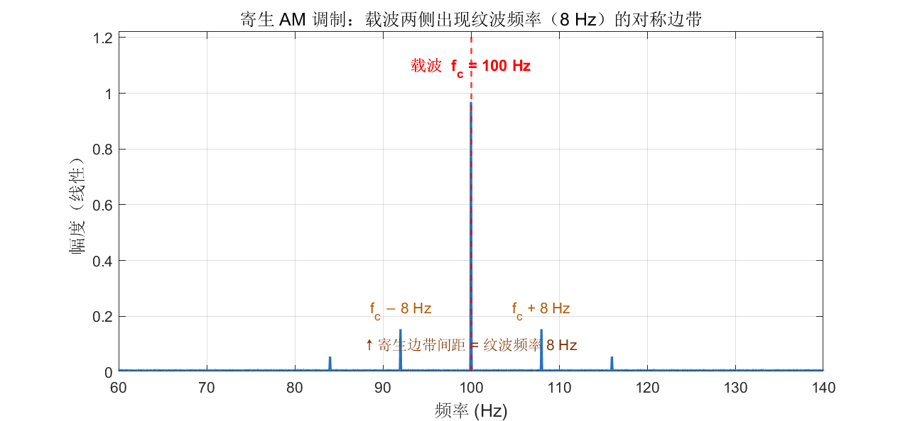

> **一个典型案例**：高精度 ADC 采样结果出现周期性误差，频率恰好等于附近 DC-DC 变换器的开关频率（300 kHz）。根本原因是变换器输出的纹波通过 PCB 地平面的阻抗，在 ADC 的参考电压上引入了寄生 AM 调制。解决方案：改进电源滤波，增加 ADC 参考电压的旁路电容，以及重新规划地平面分割。

---

> **本节小结**
>
> | 概念     | 连续波           | 脉冲                      |
> | -------- | ---------------- | ------------------------- |
> | 幅度     | 峰值/RMS         | 高低电平                  |
> | 时间参数 | 周期、频率       | 脉宽、占空比、上升时间    |
> | 频域特征 | 单根谱线（窄带） | sinc 宽谱                 |
> | 带宽关联 | 调制带宽         | $BW \approx 0.35 / t_r$ |
>
> 调制是信号"搬运"信息的手段：AM 简单但脆弱，FM 抗噪但费带宽，PM/QAM 是现代数字通信的核心。寄生调制不是设计出来的，而是寄生效应强加给电路的——识别并消除它，是高性能模拟/射频电路设计的基本功。

---

## 2.2 PCB 上的电信号：从电源到接地

一块 PCB 不是一张静止的电路图，而是信号持续流动的"城市"。本节沿信号的生命周期走一遍：电源提供能量 → 芯片产生信号 → 接口传递信号 → 滤波净化信号 → 芯片接收并处理 → 接地提供统一参考。每个环节都会影响最终信号的质量。

---

### 2.2.1 电源（Power Supply）

电源是 PCB 上一切信号的能量来源，也是噪声最重要的注入点之一。

#### 电压轨与电压域

现代 PCB 通常同时存在多个电压轨，服务不同的功能模块：

| 电压          | 典型用途              |
| ------------- | --------------------- |
| 12 V / 24 V   | 电机驱动、功率级输入  |
| 5 V           | 传统逻辑、USB 供电    |
| 3.3 V         | 主流 MCU、外设 IO     |
| 1.8 V         | 低功耗 IO、DDR 存储器 |
| 1.0 V ~ 1.2 V | SoC / FPGA 内核       |

不同电压域之间通过**稳压器（Regulator）**转换，稳压器的类型直接决定电源质量。

#### 线性稳压器（LDO）vs 开关稳压器（DCDC）

两类稳压器的工作原理截然不同，在 PCB 信号的角度各有优劣：

| 维度     | 线性稳压器（LDO）                    | 开关稳压器（DCDC）                        |
| -------- | ------------------------------------ | ----------------------------------------- |
| 工作原理 | 串联调整管连续耗散                   | 高速开关 + 储能电感/电容                  |
| 效率     | 低，$(V_{out}/V_{in})$，余量变热量 | 高，典型 85% ~ 95%                        |
| 输出纹波 | 极低，$< 10\ \mu\text{V}$ 可实现   | 较高，含开关频率（几百 kHz ~ 几 MHz）谐波 |
| 噪声特性 | 宽带白噪声为主                       | 开关频率及其谐波的离散谱线                |
| 适用场景 | ADC 参考电压、RF 电路、音频          | 主电源、大电流负载                        |

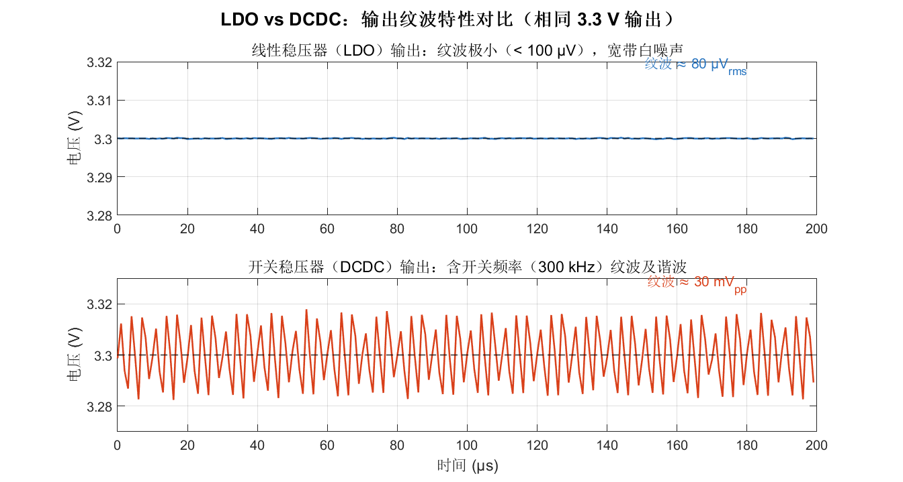

> **工程选择原则**：对噪声敏感的模拟/射频模块，优先用 LDO 单独供电，即使效率低一些。大电流、对噪声不敏感的数字模块用 DCDC。两者结合（DCDC 预稳压 → LDO 后级精滤）是高性能系统的标准做法。

#### 去耦电容（Decoupling Capacitor）

去耦电容是 PCB 上出现频率最高的元件之一，几乎每个芯片的 VCC 引脚旁边都有一个。它解决的问题是：

**问题**：芯片内部逻辑翻转时，瞬时电流需求极大（可达安培级，持续数纳秒）。PCB 走线有寄生电感，电感阻碍电流突变，导致 VCC 上出现瞬态电压跌落——这个跌落直接变成信号的噪声。

**解决**：在芯片引脚附近放一个电容，充当"本地能量仓库"，瞬态电流需求由电容就近供给，不需要经过长走线。

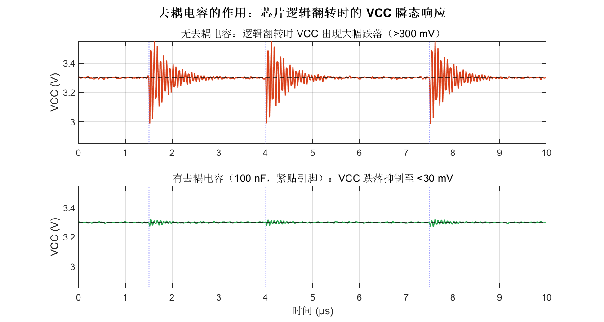

去耦电容的选型原则：

| 容值         | 类型                | 作用频段        | 放置位置               |
| ------------ | ------------------- | --------------- | ---------------------- |
| 100 nF       | 多层陶瓷（MLCC）    | 1 MHz ~ 100 MHz | 紧贴芯片 VCC 引脚      |
| 10 µF       | 钽电容 / 大容量陶瓷 | 100 kHz ~ 1 MHz | 芯片附近               |
| 100 µF 以上 | 电解电容            | 10 kHz 以下     | 电源入口处，整板级滤波 |

> **关键细节**：去耦电容的引脚走线要尽量短，连接到地平面的过孔要紧邻电容焊盘。走线越长，寄生电感越大，电容在高频下的去耦效果越差。

---

### 2.2.2 芯片：信号的产生

芯片是 PCB 上电信号的"源头"。理解芯片如何产生信号，才能正确驱动后级电路。

#### 时钟与振荡器

几乎所有数字系统都需要一个稳定的时钟基准。常见方案：

| 类型                  | 频率稳定性                     | 典型应用                   |
| --------------------- | ------------------------------ | -------------------------- |
| 晶体振荡器（Crystal） | $\pm 10 \sim 50\ \text{ppm}$ | MCU 系统时钟、USB、以太网  |
| RC 振荡器（片内）     | $\pm 1\% \sim 5\%$           | 低成本 MCU 内部时钟        |
| 温补晶振（TCXO）      | $\pm 0.5 \sim 2\ \text{ppm}$ | GPS、蓝牙、精密计时        |
| 锁相环（PLL）         | 继承参考源精度                 | 时钟倍频、多路同步时钟分配 |

晶振产生的是正弦波，经过施密特触发器整形后变成边沿陡峭的方波，驱动数字电路。

#### GPIO 输出特性

微控制器的 GPIO 引脚通常支持多种输出配置：

**推挽输出（Push-Pull）**：高低电平均由芯片主动驱动。上管导通输出 VCC，下管导通输出 GND。摆幅接近满轨，速度快。

**开漏输出（Open-Drain）**：只有下管（拉低）。高电平需要外部上拉电阻提供。多个开漏输出可以"线与"连接（I²C 总线的基础）。

**驱动强度与上升时间**：芯片通常允许配置 GPIO 的驱动电流（如 2 mA / 4 mA / 8 mA / 16 mA）。驱动越强，上升时间越短，但产生的 EMI 也越大。根据 $BW \approx 0.35/t_r$，不必要的快沿会引入不必要的高频辐射。

#### 逻辑电平标准

不同芯片之间连接时，必须确认逻辑电平兼容：

| 标准        | VCC           | $V_{OH}$（输出高） | $V_{IH}$（输入高阈值） | 典型应用     |
| ----------- | ------------- | -------------------- | ------------------------ | ------------ |
| 5V TTL      | 5 V           | ≥ 2.4 V             | ≥ 2.0 V                 | 传统逻辑 IC  |
| 3.3V CMOS   | 3.3 V         | ≥ 2.4 V             | ≥ 2.0 V                 | 主流 MCU IO  |
| 1.8V LVCMOS | 1.8 V         | ≥ 1.35 V            | ≥ 0.9 V                 | 低功耗 IO    |
| LVDS        | 差分 ±350 mV | —                   | —                       | 高速差分总线 |

> **电平不匹配的后果**：3.3 V 的 MCU 直接驱动 5 V 容忍的器件通常没问题，但反向（5 V 输出 → 3.3 V 输入）会损坏芯片。必须使用**电平转换器（Level Shifter）**。

---

### 2.2.3 接口（Interface）

接口是信号在器件之间、板卡之间流动的通道，选择合适的接口协议是 PCB 设计的关键决策之一。

#### 单端信号 vs 差分信号

**单端信号**：一根信号线 + 公共地（GND）作为参考，接收方测量信号线对地的电压。

**差分信号**：两根信号线（D+ 和 D−），接收方只关心两线之间的电压差。任何同时作用在两根线上的**共模噪声**（如地电位波动、电磁干扰）在相减时被自动消除。

$$V_{out} = V_{D+} - V_{D-} \quad \Rightarrow \quad V_{noise,CM} \text{ 抵消}$$

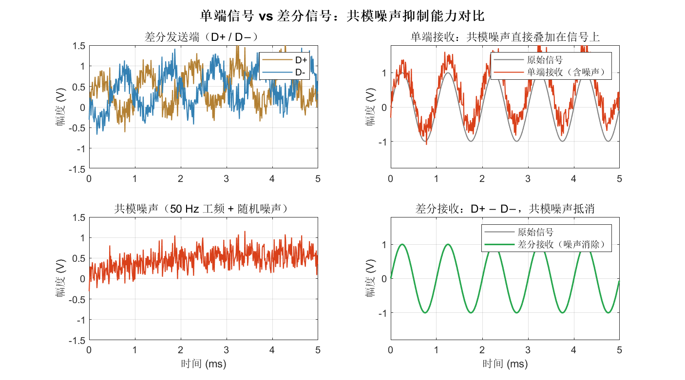

差分信号的优势随频率和距离增加而更加显著，这也是所有高速接口（USB、以太网、HDMI、PCIe）都采用差分对的原因。

#### 常见板内协议

##### UART（Universal Asynchronous Receiver-Transmitter）

异步串口，两线制（TX / RX），无时钟线。收发双方提前约定波特率，靠起始位触发采样。

帧格式：`[起始位(0)] [数据位 5~9 bit] [可选奇偶校验位] [停止位(1)]`

- 优点：电路最简单，只需两根线，调试极方便
- 缺点：速率有限（常用最高 921600 bps），无寻址，点对点
- 典型用途：调试串口、GPS 模块、蓝牙透传

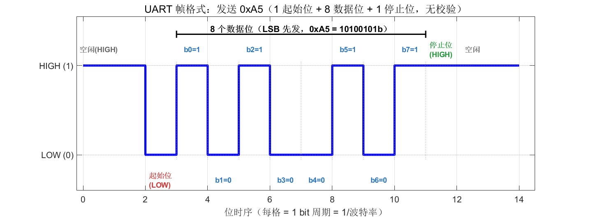

##### SPI（Serial Peripheral Interface）

同步四线制：MOSI（主发从收）/ MISO（主收从发）/ SCLK（时钟）/ CS（片选）。

- 全双工，速率高（可达数十 MHz）
- 一主多从，靠 CS 线区分从设备
- 无应答机制，主机无法知道从机是否收到
- 典型用途：Flash 存储、ADC/DAC、显示屏、传感器

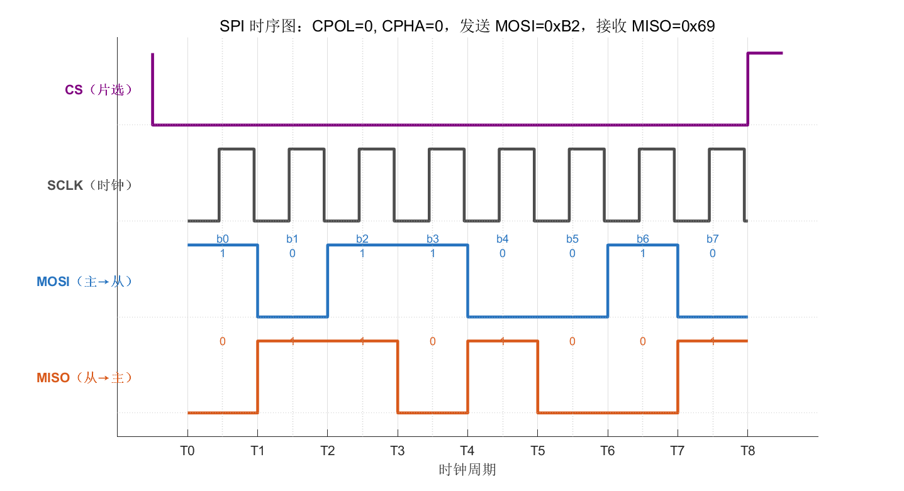

##### I²C（Inter-Integrated Circuit）

同步两线制：SDA（数据）/ SCL（时钟），开漏输出，需要上拉电阻。

- 支持多主多从，7 bit 地址空间（最多 127 个从设备）
- 速率较低：标准 100 kbps，快速 400 kbps，高速 3.4 Mbps
- 有应答（ACK/NACK）机制，可靠性优于 SPI
- 典型用途：传感器（IMU、温湿度）、EEPROM、电源管理 IC

##### PWM（Pulse Width Modulation）

通过调节占空比来传递模拟量信息，本质是用数字信号编码"平均值"。

$$\bar{V}_{out} = D \times V_{H} = \frac{t_w}{T} \times V_{H}$$

接收端通过低通滤波器（RC）将 PWM 还原为模拟电压；或者直接驱动电机、LED 等响应时间远慢于 PWM 频率的负载，负载的惯性自然完成积分。

#### 板外接口

| 接口                 | 拓扑             | 最大距离          | 典型速率 | 特点             |
| -------------------- | ---------------- | ----------------- | -------- | ---------------- |
| RS-485               | 差分，半双工     | 1200 m            | 10 Mbps  | 工业总线，多节点 |
| CAN                  | 差分，多主       | 500 m（1 Mbps时） | 1 Mbps   | 汽车、机器人     |
| USB 2.0              | 差分，主从       | 5 m               | 480 Mbps | 通用外设         |
| 以太网（100BASE-TX） | 差分，变压器隔离 | 100 m             | 100 Mbps | 网络通信         |

---

### 2.2.4 滤波：电路实现

Chapter 1 已经介绍了滤波的频域原理，本节专注于 PCB 上的**电路实现**——用什么元件、怎么选型、放在哪里。

#### RC 低通滤波器

最简单的滤波电路：一个电阻串联，一个电容对地并联。

```text
  信号输入 ──[R]──┬── 信号输出
                  │
                 [C]
                  │
                 GND
```

截止频率：

$$\boxed{f_c = \frac{1}{2\pi RC}}$$

截止频率以上，每倍频程衰减 −20 dB（即 −6 dB/倍频程）。

**选型实例**：ADC 输入端抗混叠滤波，ADC 采样率 100 kSPS，需要在 50 kHz（奈奎斯特频率）处开始衰减。选 R = 1 kΩ，C = 3.3 nF → $f_c = 1/(2\pi \times 1000 \times 3.3\times10^{-9}) \approx 48\ \text{kHz}$。

**注意**：RC 滤波器的电阻 R 与后级输入阻抗形成分压，选 R 时不能过大，否则影响信号幅度。

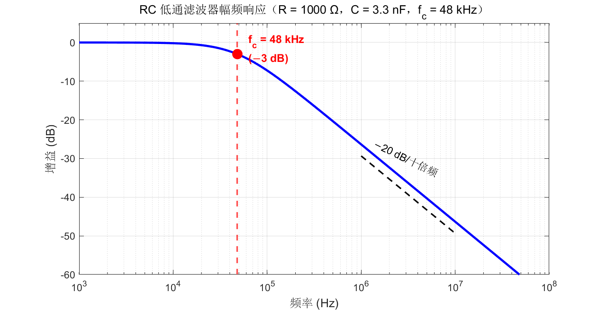

#### 铁氧体磁珠（Ferrite Bead）

磁珠外形像电感，但行为不同：

- **低频**：表现为小电感，阻抗低，信号和直流电流可以自由通过
- **高频**：铁氧体材料损耗增大，阻抗急剧升高，高频噪声被转换为热量耗散

磁珠的型号用**阻抗@频率**描述，例如 `600Ω @ 100 MHz`，意味着在 100 MHz 处插入损耗约 600 Ω。

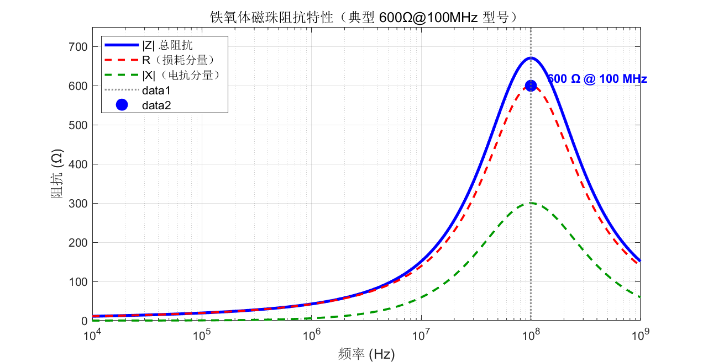

**典型用法**：电源线上串联磁珠，隔离数字电路的开关噪声，防止其污染模拟电路的电源轨。

```text
  DCDC 输出 ──[磁珠]──┬── 模拟电路 VCC
                      │
                    [10 µF] [100 nF]
                      │
                     GND
```

磁珠 + 后级电容构成一个低通滤波网络，截止频率由磁珠的等效阻抗和电容共同决定。

#### LC 滤波器

用电感替代 RC 中的电阻，截止更陡（−40 dB/十倍频程），且无直流压降损耗。

$$f_c = \frac{1}{2\pi\sqrt{LC}}$$

**优点**：截止特性更陡，效率更高（电感不耗电）

**缺点**：LC 在谐振频率处会产生尖峰（Q 值越高越明显），需要在电感上并联阻尼电阻或选用有损电感。

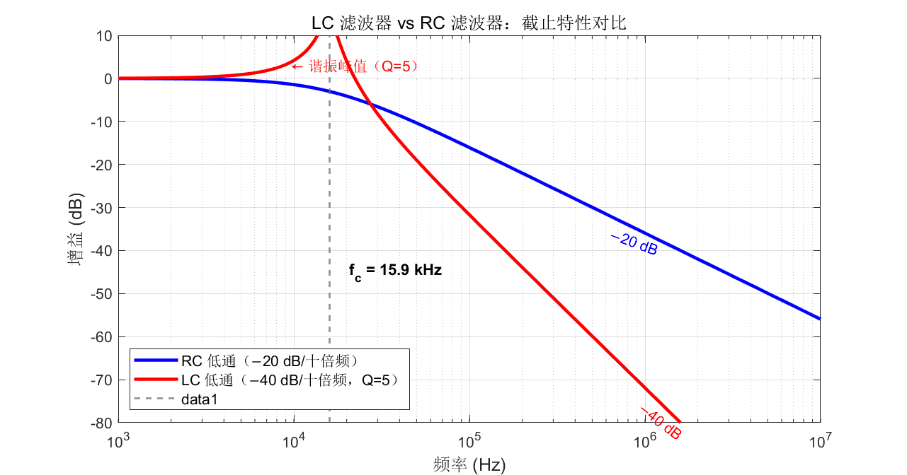

典型应用：开关电源的输出滤波，将开关纹波压制到 mV 级以下。

#### 共模扼流圈（Common Mode Choke）

用于差分信号线对的共模噪声抑制。两根差分线绕在同一磁芯上，绕向相反：

- **差模信号**（D+ 与 D− 反相）：两线磁场相互抵消，扼流圈呈低阻抗，信号正常通过
- **共模噪声**（两线同向）：磁场叠加，扼流圈呈高阻抗，噪声被抑制

这使得共模扼流圈能在不影响数据传输的前提下，大幅抑制 EMI 辐射。常见于 USB 线、以太网变压器前端。

---

### 2.2.5 芯片：信号的接收与处理

信号经过传输和滤波后，到达接收端芯片，在这里完成从物理电信号到有用信息的转换。

#### ADC（模数转换器）

ADC 将连续的模拟电压转换为离散的数字编码，是模拟世界进入数字处理系统的"入口"。

**两个核心参数**：

**采样率（Sample Rate）**：每秒采集的样本数，单位 SPS（Samples Per Second）。根据奈奎斯特定理，采样率必须大于被测信号最高频率的 2 倍，否则产生**混叠（Aliasing）**：

$$f_s > 2 f_{max}$$

**分辨率（Resolution）**：ADC 的位数 $N$，决定最小可分辨电压：

$$\text{LSB} = \frac{V_{ref}}{2^N}$$

分辨率与理论信噪比的关系：

$$\text{SNR}_{理论} = 6.02N + 1.76 \ \text{dB}$$

| 分辨率 | LSB（Vref = 3.3 V） | 理论 SNR |
| ------ | ------------------- | -------- |
| 8 bit  | 12.9 mV             | 49.9 dB  |
| 12 bit | 0.81 mV             | 74.0 dB  |
| 16 bit | 50 µV              | 98.1 dB  |
| 24 bit | 0.20 µV            | 146.0 dB |

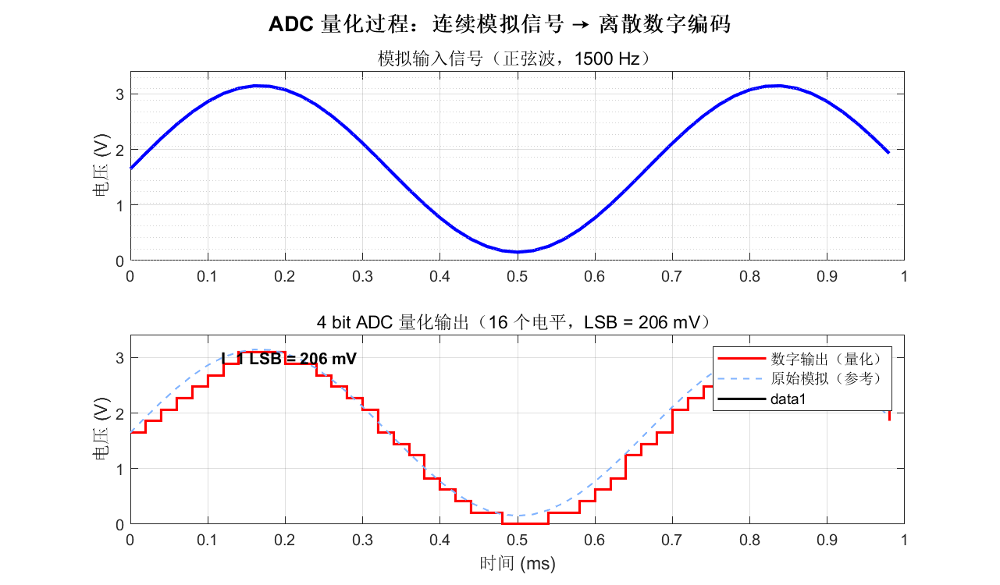

**ADC 前必须加抗混叠低通滤波器**，将高于 $f_s/2$ 的频率成分截断，防止高频噪声折叠到有效频段内。

#### 运算放大器（Op-Amp）

运放是模拟信号处理的核心器件，在 ADC 前端承担放大、缓冲、滤波等任务。

**电压跟随器（缓冲器）**：增益 = 1，输入阻抗极高，输出阻抗极低。用于隔离信号源与后级负载，防止负载影响信号源。

**同相放大器**：

$$A_v = 1 + \frac{R_2}{R_1}$$

**差分放大器**：只放大两输入之差，抑制共模干扰，适合处理来自传感器的小差分信号。

运放选型时需关注：**增益带宽积（GBW）**——增益越高，可用带宽越窄，两者之积为常数。用运放做高增益宽带放大时，需要多级级联。

#### MCU / FPGA 中的数字信号处理

经过 ADC 转换的数字信号，在 MCU 或 FPGA 中接受进一步处理，对应 Chapter 1 介绍的各种算法：

- **数字滤波**：FIR/IIR 滤波器，对应模拟 RC/LC 滤波器在数字域的等效
- **FFT**：频域分析，提取频率特征
- **PID 控制**：闭环反馈，对电机、温度等物理量进行控制

MCU 完成处理后，通过 DAC 或 PWM 将结果重新转换为模拟信号，驱动执行器，形成完整的闭环系统。

---

### 2.2.6 接地（Grounding）

接地是 PCB 设计中最容易被忽视、出问题时又最难排查的环节。

#### 接地的物理本质

**GND 不是"电消失的地方"**，而是全板共同约定的**电位参考点（0 V 基准）**。

更重要的是：**任何信号电流都需要回路**。从芯片 A 流出的信号电流，必须通过某条路径回到芯片 A 的供电端。这条返回路径，就是地电流的流向。地电流走哪条路，决定了噪声在哪里出现。

#### 地平面（Ground Plane）

多层 PCB 通常将某一整层铺满铜作为地平面，其优势在于：

- **低阻抗**：整层铜的直流电阻极低，地电位几乎均匀
- **信号回流自动优化**：在高频下，地电流会自动选择阻抗最低（即电感最小）的路径——恰好是信号走线正下方的最短路径。这将信号回路面积压到最小，从而最小化辐射

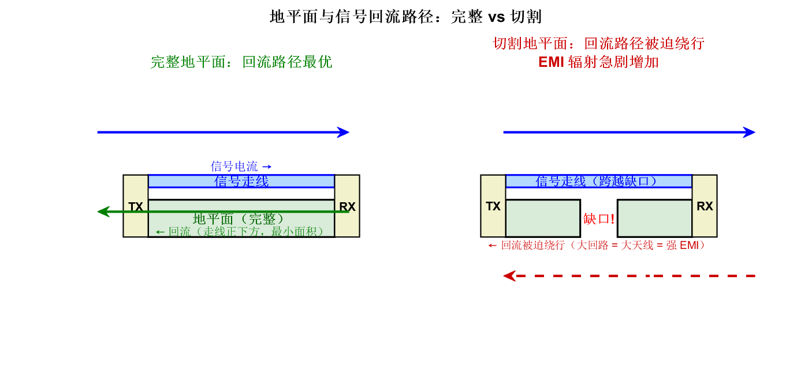

> **关键直觉**：地平面被切割（如走线穿越地平面）时，回流路径被迫绕行，回路面积增大，相当于一根天线，EMI 辐射急剧增加。**不要在关键信号走线下方切割地平面**。

#### 数字地 vs 模拟地

数字电路的大量高速开关动作会在地平面上产生高频电流，造成局部地电位的微小波动。对数字电路而言，几十 mV 的地噪声无关紧要；但对 ADC、运放等模拟电路，地电位的波动会直接叠加在信号上，成为噪声。

**两种常见策略**：

**分割地平面（Split Ground Plane）**：将模拟地和数字地分开铺铜，仅在一点（通常在 ADC 下方）单点连接。优点是隔离彻底；缺点是增加布局复杂度，且分割边界若有信号跨越，会造成严重 EMI。

**统一地平面 + 合理布局**：保持地平面完整，但将模拟电路区域和数字电路区域分开布置，让数字地电流不流经模拟电路区域。这是现代高性能 ADC 数据手册（如 ADI、TI）推荐的做法。

#### 接地环路（Ground Loop）

当两个设备各自有独立的接地点，且两个接地点之间存在电位差时，就形成**接地环路**：

```text
设备 A ──信号线──→ 设备 B
设备 A ←──地线──── 设备 B
           ↑
     两个 GND 之间有电位差 ΔV
     → ΔV / Z_loop 的电流在环路中流动
     → 叠加到信号上成为噪声
```

**症状**：音频设备出现 50/60 Hz 嗡嗡声（工频干扰通过地环路耦合），长距离信号传输出现低频干扰。

**解决方案**：

- 使用差分输入接收器（共模抑制消除 ΔV 的影响）
- 信号端加隔离变压器或光耦合器，彻底断开地环路
- 合并为单点接地（星形接地）

---

> **本节小结**
>
> PCB 上的信号质量由六个环节共同决定：
>
> | 环节     | 核心问题           | 关键工具/手段               |
> | -------- | ------------------ | --------------------------- |
> | 电源     | 纹波与瞬态电流     | LDO/DCDC 选型，去耦电容布置 |
> | 芯片产生 | 电平兼容，驱动能力 | 电平标准核对，驱动强度配置  |
> | 接口     | 速率、距离、抗噪   | 单端/差分选择，协议匹配     |
> | 滤波     | 噪声注入点         | RC/LC/磁珠/共模扼流圈       |
> | 芯片接收 | 精度、带宽         | ADC 位数与采样率，运放 GBW  |
> | 接地     | 回流路径与参考基准 | 完整地平面，合理分区布局    |

---

## 2.3 空气中的电磁波

电信号在 PCB 上以电压、电流的形式传输；一旦离开导体进入空气，它就变成了**电磁波**——一对相互正交、相互激发、以光速传播的振荡电场与磁场。本节的任务是把"电路里的信号"与"空气中的波"接成一条完整的概念链。

---

### 2.3.1 电磁波的产生与传播

#### 麦克斯韦方程组的一句话总结

```text
变化的电场 →  产生变化的磁场
变化的磁场 →  产生变化的电场
   ↓
两者互相激发、互相维系 → 在空间中自我传播 → 电磁波
```

这正是 1865 年麦克斯韦从他的方程组中推导出的惊人结论：电场与磁场的扰动会以一个特定速度向外传播，而这个速度恰好等于光速：

$$c = \frac{1}{\sqrt{\mu_0 \varepsilon_0}} \approx 2.998 \times 10^8\ \text{m/s}$$

光本身就是电磁波——这是物理学史上最优美的统一之一。

#### 平面波的基本结构

在远离辐射源的自由空间中，电磁波局部可近似为**平面波**，具有以下特征：

- **横波（Transverse Wave）**：电场 $\vec{E}$ 和磁场 $\vec{B}$ 都垂直于传播方向 $\hat{k}$
- **正交关系**：$\vec{E} \perp \vec{B} \perp \hat{k}$，三者构成右手坐标系
- **同相振荡**：$\vec{E}$ 和 $\vec{B}$ 同时达到峰值，同时过零
- **幅度关系**：$|\vec{E}| = c \cdot |\vec{B}|$

$$\vec{E}(z, t) = \hat{x}\, E_0 \cos(kz - \omega t), \quad \vec{B}(z, t) = \hat{y}\, \frac{E_0}{c} \cos(kz - \omega t)$$

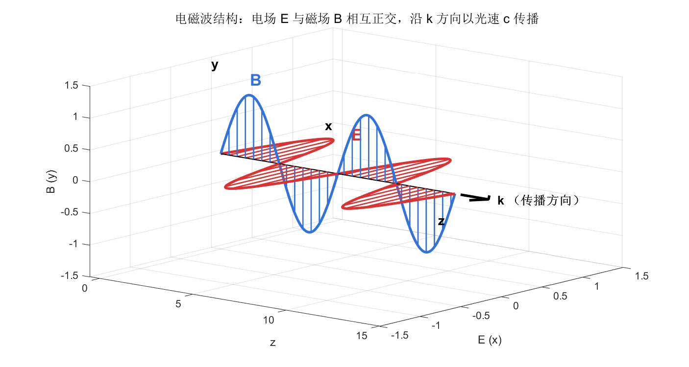

#### 偏振（Polarization）

电场的振动方向定义了电磁波的**偏振方向**：

| 偏振类型               | 描述                          | 典型应用                                    |
| ---------------------- | ----------------------------- | ------------------------------------------- |
| 线偏振（Linear）       | E 沿固定方向振动（垂直/水平） | FM 广播、WiFi、地面电视                     |
| 圆偏振（Circular）     | E 末端沿圆周旋转              | GPS、卫星通信（穿过电离层旋转后仍接收得到） |
| 椭圆偏振（Elliptical） | E 末端沿椭圆旋转              | 一般实际信号的极化失配状态                  |

收发天线的偏振方向应当匹配：垂直偏振的 WiFi 路由器天线竖直安装，正是因为接收端笔记本天线大多也是竖直方向的——偏振失配 90°会带来约 20 dB 的额外损耗。

#### 近场与远场

电磁波从天线辐射出去时，并非一上来就是规则的平面波。空间被划分为两个区域：

$$d_{\text{far}} \approx \frac{2 D^2}{\lambda} \quad (D = \text{天线最大尺寸})$$

| 区域               | 距离条件                              | 场结构                      | 工程含义                     |
| ------------------ | ------------------------------------- | --------------------------- | ---------------------------- |
| 近场（Near Field） | $r < \lambda/(2\pi)$                | E 和 B 不正交，相位关系复杂 | NFC、无线充电、RFID 在此工作 |
| 过渡区             | $\lambda/(2\pi) < r < 2D^2/\lambda$ | 场结构过渡                  | 多数 EMC 测试场地需避开此区  |
| 远场（Far Field）  | $r > 2D^2/\lambda$                  | 标准平面波                  | 通信、雷达的工作区           |

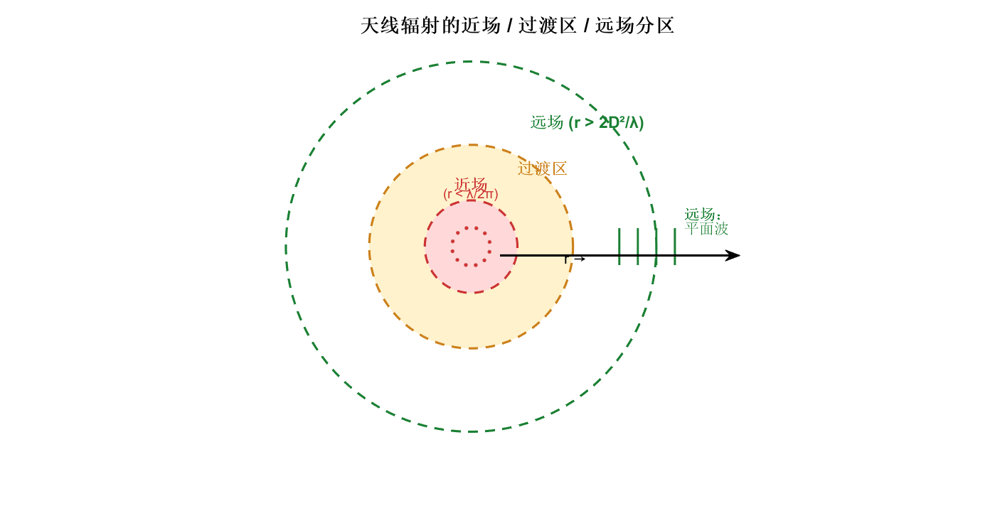

---

### 2.3.2 电磁波谱

电磁波按频率分布构成一条连续的谱，跨越超过 20 个数量级。所有这些"波"本质上都是同一回事，区别只在频率（或波长）：

| 频段                 | 频率范围                        | 波长范围            | 典型应用                                       |
| -------------------- | ------------------------------- | ------------------- | ---------------------------------------------- |
| ELF / VLF            | 3 Hz ~ 30 kHz                   | 100 km ~ 10 km      | 潜艇通信、地磁勘探                             |
| LF / MF              | 30 kHz ~ 3 MHz                  | 10 km ~ 100 m       | AM 广播、航海导航                              |
| HF（短波）           | 3 ~ 30 MHz                      | 100 m ~ 10 m        | 短波广播、业余无线电（电离层反射，超视距通信） |
| VHF                  | 30 ~ 300 MHz                    | 10 m ~ 1 m          | FM 广播、电视、对讲机                          |
| UHF                  | 300 MHz ~ 3 GHz                 | 1 m ~ 10 cm         | 手机（4G/5G Sub-6）、WiFi 2.4G、GPS            |
| SHF（微波）          | 3 ~ 30 GHz                      | 10 cm ~ 1 cm        | WiFi 5G/6E、卫星、雷达、5G 毫米波边缘          |
| EHF（毫米波）        | 30 ~ 300 GHz                    | 10 mm ~ 1 mm        | 5G mmWave、车载雷达、安检成像                  |
| 太赫兹               | 0.3 ~ 3 THz                     | 1 mm ~ 0.1 mm       | 6G 候选、生物医学成像                          |
| 红外 / 可见光 / 紫外 | 3 × 10¹¹ Hz ~ 3 × 10¹⁶ Hz | mm ~ nm             | 光通信、激光雷达、照明、显示                   |
| X 射线 / γ 射线     | $> 10^{16}$ Hz                | $< 10\ \text{nm}$ | 医疗成像、无损检测                             |

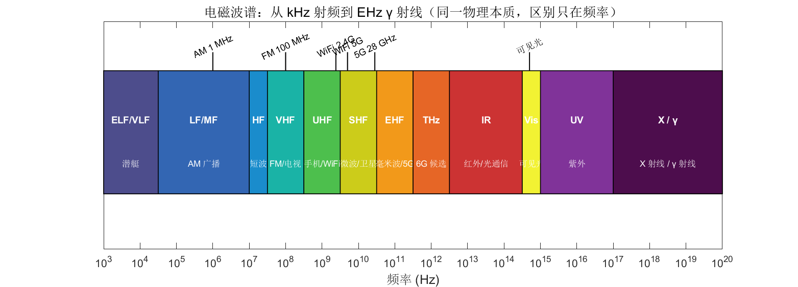

> **频率越高，特点是什么？**
>
> - 波长越短 → 天线越小 → 设备越紧凑（手机毫米波天线小到可以集成在 SoC 封装内）
> - 带宽越大 → 数据速率越高（5G 毫米波单载波 400 MHz vs Sub-6 单载波 100 MHz）
> - 绕射能力越差 → 遇障碍物即被阻挡，更依赖直视路径（LOS）
> - 大气吸收越严重 → 60 GHz 处的氧吸收峰使该频段反而被用于短距高保密通信

---

### 2.3.3 天线基础

天线是电路与空间之间的**能量转换器**：发射端把导线里的高频电流转换成自由空间中的电磁波；接收端把自由空间中的电磁波转换回导线里的感应电流。

#### 天线为什么有"长度"要求

辐射的本质是**加速运动的电荷**。要让一段导线高效辐射，电荷必须在导线两端来回振荡足够远的距离——这意味着天线的物理长度需要与信号波长相比可观。一个直观的经验：

$$L_{\text{有效}} \sim \frac{\lambda}{4} \sim \frac{\lambda}{2}$$

| 频率                | 波长$\lambda$ | 典型$\lambda/4$ 天线长度 |
| ------------------- | --------------- | -------------------------- |
| 100 MHz（FM 广播）  | 3 m             | 75 cm                      |
| 900 MHz（GSM）      | 33 cm           | 8 cm                       |
| 2.4 GHz（WiFi）     | 12.5 cm         | 3 cm                       |
| 28 GHz（5G mmWave） | 1.07 cm         | 2.7 mm                     |
| 60 GHz              | 5 mm            | 1.25 mm                    |

这解释了为什么 AM 广播塔高达数百米，而手机 WiFi 天线可以塞进卡片厚的机壳里——本质上都是 $\lambda/4$ 在不同频率下的几何缩放。

#### 方向图（Radiation Pattern）

天线并非向所有方向均匀辐射，而是有方向性。**方向图**描述辐射功率在空间各角度上的分布：

| 类型                        | 方向图                       | 增益                 | 典型应用                          |
| --------------------------- | ---------------------------- | -------------------- | --------------------------------- |
| 全向天线（Omnidirectional） | 水平面均匀，垂直面"甜甜圈"状 | 低（~2 ~ 5 dBi）     | WiFi 路由器、对讲机               |
| 定向天线（Directional）     | 主瓣集中在一个方向           | 中等（~10 ~ 20 dBi） | 微波回传、点对点通信              |
| 高增益阵列（Array）         | 极窄主瓣，可电子扫描         | 高（> 25 dBi）       | 雷达、卫星地面站、5G 基站波束赋形 |

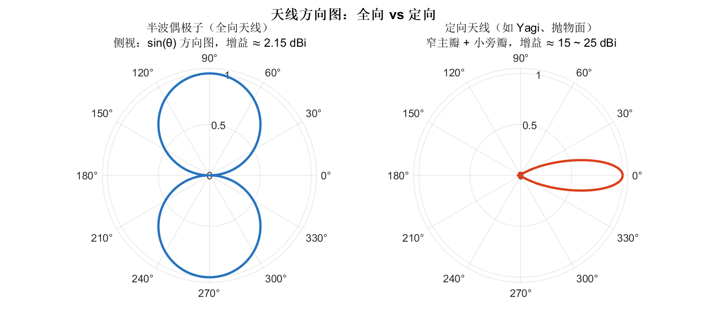

**天线增益（Gain）的含义**：相同输入功率下，相对于理想全向辐射器（Isotropic Radiator），该天线在主瓣方向上的功率增强倍数（以 dBi 计）。增益不是天线"自己产生"了功率，而是把功率集中到了某个方向——其他方向必然减弱。

---

### 2.3.4 自由空间传播

电磁波在自由空间传播时，能量在球面上扩散，功率密度随距离平方衰减。这就是著名的**自由空间路径损耗（FSPL，Free Space Path Loss）**：

$$\boxed{\text{FSPL}_{\text{dB}} = 20\log_{10}(d) + 20\log_{10}(f) + 20\log_{10}\!\left(\frac{4\pi}{c}\right)}$$

代入 $c = 3 \times 10^8\ \text{m/s}$，用 km 和 MHz 作单位时简化为：

$$\text{FSPL}_{\text{dB}} \approx 32.45 + 20\log_{10}(d_{\text{km}}) + 20\log_{10}(f_{\text{MHz}})$$

记忆要点：**距离每翻倍 +6 dB，频率每翻倍 +6 dB**。

| 链路         | 距离       | 频率      | FSPL    |
| ------------ | ---------- | --------- | ------- |
| WiFi 室内    | 10 m       | 2.4 GHz   | 60 dB   |
| WiFi 室内    | 10 m       | 5 GHz     | 66 dB   |
| 4G 城区      | 1 km       | 1.8 GHz   | 97.5 dB |
| GPS 地面接收 | 20,200 km  | 1.575 GHz | 182 dB  |
| 月球通信     | 384,000 km | 2 GHz     | 210 dB  |

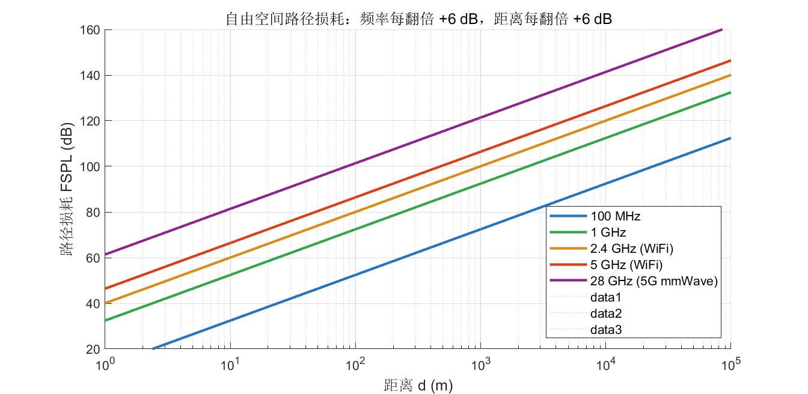

> **链路预算的直觉**：发射功率（dBm）+ 发射天线增益（dBi）− 路径损耗（dB）+ 接收天线增益（dBi）= 接收功率（dBm）。如果结果高于接收机灵敏度（如 −90 dBm）就能解调，否则就丢包。GPS 卫星的发射功率仅 ~25 W，经过 182 dB 衰减到达地面时已是 −127 dBm，比手机能收的最弱 4G 信号还低 30 dB——靠的是 GPS 接收机利用扩频码增益把信号从噪声底以下"拽出来"。

---

### 2.3.5 多径与衰落

理想自由空间路径损耗只描述了"直线一条路径"的情形。现实中，信号会被建筑、地面、墙壁反射，多条路径同时到达接收端，引发**多径效应（Multipath）**。

#### 多径的两类影响

**① 小尺度衰落（Small-scale Fading）**：多条路径的信号在接收端**矢量叠加**。由于各路径长度不同，相位关系也不同，叠加结果可能强（相长干涉）也可能弱（相消干涉）。移动接收端几个厘米（约 $\lambda/2$）就可能从信号最强变为最弱：

$$r(t) = \sum_{k=1}^{N} a_k \cdot e^{j\phi_k} \cdot s(t - \tau_k)$$

这种快速起伏的统计模型常用**瑞利分布（Rayleigh）**或**莱斯分布（Rician）**描述。

**② 时延扩展（Delay Spread）**：不同路径到达时间不同，造成符号间干扰（ISI）。在室内典型时延扩展约 50 ns，室外城区约 1 µs。如果符号周期不远大于时延扩展，相邻符号会"撞在一起"，必须用 OFDM 或均衡器来对抗。

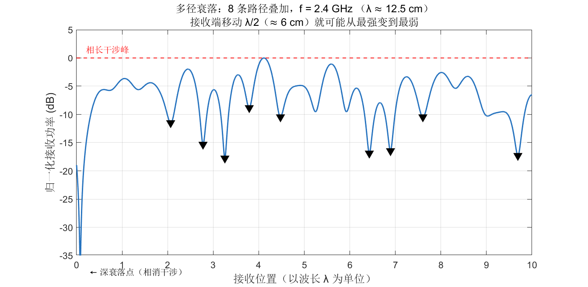

#### 大尺度衰落与遮蔽

除小尺度的快速起伏外，还有由建筑、地形遮挡造成的**大尺度衰落（Shadowing）**，通常用对数正态分布建模。无线规划中常用的传播模型（Okumura-Hata、COST-231、3GPP 模型等）就是为了把这些经验规律压缩成可计算的公式。

#### 工程对策一览

| 现象           | 对策                                                |
| -------------- | --------------------------------------------------- |
| 频率选择性衰落 | OFDM 把信号拆成多个窄带子载波，单个子载波内信道平坦 |
| 时延扩展 / ISI | 加循环前缀（CP）+ 频域均衡（OFDM 标准做法）         |
| 深度衰落点     | 分集（空间/时间/频率/极化分集），多天线（MIMO）合并 |
| 移动多普勒     | 信道估计 + 频偏跟踪                                 |
| 视距阻挡       | 中继、波束赋形绕过遮挡物                            |

---

### 2.3.6 从 PCB 到天空：完整的信号生命周期

至此，我们已经把信号从"芯片里诞生"一直追踪到"在空气中传播再到达另一台设备"的全过程。把三节内容串起来看：

```text
基带数据（0/1 比特流）                           ← MCU 内部
       ↓ 编码 / 成形
基带信号 s(t)（低频，含信息）                    ← Chapter 1 概念
       ↓ 调制（AM/FM/QAM）                      ← 2.1.4
已调信号（中频/射频，带载波）
       ↓ 经过功放、滤波、阻抗匹配                 ← 2.2 PCB 电路
天线馈电端的射频电流
       ↓ 天线辐射                                ← 2.3.3
自由空间电磁波
       ↓ 传播（路径损耗、多径、衰落）              ← 2.3.4 ~ 2.3.5
到达接收天线
       ↓ 接收链路（LNA、变频、解调）             ← 2.2 PCB 电路（反向）
还原基带信号
       ↓ ADC → DSP                              ← 2.2.5
恢复原始数据
```

每一个环节都对应本章中具体的一节，每一个环节都既是工程师可以优化的"旋钮"，也是性能损失的潜在来源。理解了这个完整链条，下一章我们就可以站在系统视角，讨论**信号完整性（Signal Integrity）与电磁兼容（EMC）**——也就是如何让信号从源头到目的端"原汁原味"地保留下来。

---

> **本节小结**
>
> | 概念       | 核心要点                                                  |
> | ---------- | --------------------------------------------------------- |
> | 电磁波本质 | 麦克斯韦方程的解，$E \perp B \perp \hat{k}$，以光速传播 |
> | 偏振       | E 的振动方向，收发天线偏振要匹配                          |
> | 频谱划分   | 频率越高 → 波长越短、带宽越大、绕射越差                  |
> | 天线长度   | 约$\lambda/4 \sim \lambda/2$，决定了不同频段设备形态    |
> | 路径损耗   | $\propto d^2$ 且 $\propto f^2$，每翻倍 +6 dB          |
> | 多径效应   | 小尺度衰落 + 时延扩展，OFDM / MIMO 是主要对策             |
