# Chapter 3 电子电路基本原理、PN 结与现代常用元器件

前两章我们把"信号"这件事讲透了：信号是什么、如何描述、如何在 PCB 上流动、如何变成空气中的电磁波。但有一个问题一直被悬置——**这些信号究竟是被什么"东西"产生、搬运、整形、放大的？** 答案就是电路里那一颗颗元器件。

本章从最底层补齐这块拼图：先建立分析任何电路都绕不开的**基本物理量与定律**（3.1），再深入到几乎所有现代有源器件的物理基石——**半导体与 PN 结**（3.2），最后系统梳理工程中天天打交道的**常用元器件**（3.3）。

贯穿全章的一条主线是**伏安特性曲线（V-I Characteristic）**：横轴电压、纵轴电流，一条曲线就是一个元件的"身份证"。看懂了伏安特性，就看懂了元件在电路里会如何表现。

---

## 3.1 电子电路基本原理

### 3.1.1 电路的基本物理量

电路分析的全部内容，几乎都围绕几个基本物理量展开。先把这套"词汇表"建立起来。

| 物理量 | 符号 | 单位 | 直观含义 |
| ------ | ---- | ---- | -------- |
| 电荷   | $Q$ | 库仑（C） | 电的"量"，电子电荷 $e \approx 1.6\times10^{-19}$ C |
| 电流   | $I$ | 安培（A） | 电荷的流动速率，$I = \mathrm{d}Q/\mathrm{d}t$ |
| 电压   | $U$ | 伏特（V） | 单位电荷的能量差，$U = \mathrm{d}W/\mathrm{d}Q$ |
| 电动势 | $E$ | 伏特（V） | 电源把其他能量转化为电能的本领 |
| 功率   | $P$ | 瓦特（W） | 单位时间转移的能量，$P = UI$ |

几个必须建立的直觉：

**① 电流是"流量"，电压是"压差"。** 一个经典且贴切的类比是水管：电压像管道两端的水压差（势能差），电流像每秒流过的水量。没有压差，水不会流；没有电压，电流也不存在。

**② 电流方向的约定。** 工程上规定电流方向为**正电荷流动的方向**，与电子实际流动方向相反。这是历史遗留的约定，记住即可，分析时统一用"正电荷流向"。

**③ 电压是相对的。** 谈论"某点的电压"必须指明参考点（通常是 GND，记为 0 V）——这正是 Chapter 2.2.6 强调的"接地是电位参考点"。脱离参考点的电压没有意义。

**④ 功率与能量。** $P = UI$ 描述能量转移的快慢。对电阻，能量转化为热（$P = I^2R = U^2/R$）；对电源，$P = EI$ 是它向电路输出的功率。能量 $W = \int P\,\mathrm{d}t$，单位焦耳（J），电费按千瓦时（kWh）计。

---

### 3.1.2 电路的基本定律

整个电路理论的地基，其实只有三条定律。

#### 欧姆定律（Ohm's Law）

对线性电阻，电压与电流成正比：

$$\boxed{U = I R}$$

其中 $R$ 是电阻（单位欧姆 Ω），它的倒数 $G = 1/R$ 称为电导（单位西门子 S）。欧姆定律是后面所有"伏安特性"讨论的出发点——它描述的恰好是电阻这个元件的伏安特性：一条过原点的直线。

#### 基尔霍夫电流定律（KCL）

**流入任一节点的电流之和，等于流出的电流之和。**

$$\sum_{\text{流入}} I = \sum_{\text{流出}} I \quad\Longleftrightarrow\quad \sum_k I_k = 0$$

物理本质是**电荷守恒**：节点不会凭空产生或储存电荷，进多少必须出多少。

```text
        I1 ──→●──→ I2
              │
              ↓ I3

      KCL:  I1 = I2 + I3
```

#### 基尔霍夫电压定律（KVL）

**沿任一闭合回路，电压升之和等于电压降之和。**

$$\sum_k U_k = 0 \quad (\text{沿闭合回路一周})$$

物理本质是**能量守恒**：电荷绕回路一圈回到原点，净能量变化为零。电源提供的电压升，必然等于各元件上电压降的总和。

> **为什么这两条定律如此重要？** KCL + KVL + 各元件的伏安特性 = 求解任意电路的完整方程组。无论电路多复杂，"列 KCL/KVL 方程，代入元件 V-I 关系，解方程"是万能套路。本章后面介绍的每一个元件，本质上都是在为这套方程组提供它那一行"伏安特性方程"。

---

### 3.1.3 元件的分类

面对琳琅满目的元器件，先建立几条分类维度，能极大降低认知负担。

**① 无源 vs 有源（Passive vs Active）**

| 类别 | 定义 | 典型元件 |
| ---- | ---- | -------- |
| 无源元件 | 不能向电路净输出能量，只能消耗或储存 | 电阻、电容、电感 |
| 有源元件 | 能控制或提供能量（需要外部供电） | 二极管*、三极管、MOSFET、运放 |

> *二极管是个边界情况：它本身无源，但因具有非线性单向导电性，常被归入"半导体器件"一类与有源器件一起讨论。

**② 线性 vs 非线性（Linear vs Nonlinear）**

- **线性元件**：伏安特性是过原点的直线，满足叠加原理。电阻、（理想）电容、电感都是线性元件。
- **非线性元件**：伏安特性是曲线。二极管、三极管、MOSFET 全是非线性器件——而**正是这种非线性，才能实现整流、放大、开关、逻辑运算等"智能"功能**。线性元件只能搬运能量，非线性元件才能加工信号。

**③ 集总 vs 分布（Lumped vs Distributed）**

这一区分已在 Chapter 2.1.1（波长）埋下伏笔：当元件尺寸远小于信号波长时，可视为**集总参数**（一个电阻就是一个电阻）；当尺寸与波长可比时，必须按**分布参数**（传输线）处理。本章默认讨论集总元件。

---

### 3.1.4 伏安特性曲线：元件的"身份证"

把一个二端元件接上可调电压，逐点测量"加多少电压、流过多少电流"，把这些点画在 **U-I 平面**上（横轴电压 $U$，纵轴电流 $I$），得到的曲线就是该元件的**伏安特性曲线**。

它之所以是元件的"身份证"，是因为：

- **曲线的形状** 完全决定了元件在电路中的行为
- **曲线上某点的斜率** $\mathrm{d}I/\mathrm{d}U$ 是该工作点的**电导**（其倒数是动态电阻）
- **曲线落在哪些象限** 透露了元件能否消耗/提供能量

以最简单的电阻为例。电阻的伏安特性是一条**过原点的直线**，斜率等于电导 $G = 1/R$：

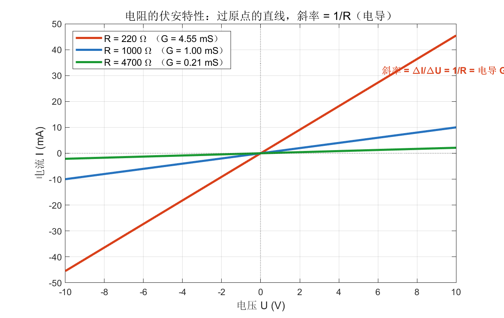

从图中读出几个关键信息：

- 三条线都**过原点**——无电压则无电流，这是无源元件的共性
- 电阻越小，直线越陡（电导越大，同样电压下电流更大）
- 直线落在第一、第三象限，且关于原点对称——说明电阻**双向对称**，正反接没有区别
- 直线意味着**线性**：电压翻倍，电流也翻倍

> **对照阅读**：把这张"直线"记牢，因为本章后面所有器件的伏安特性都将与它对比。**直线 = 线性 = 老实搬运能量；曲线 = 非线性 = 能加工信号。** 二极管把这条线掰成了单向的指数曲线，三极管和 MOSFET 则把它变成了一族受控曲线——非线性正是器件功能的来源。

---

### 3.1.5 工作点与负载线

实际电路中，一个非线性器件总是和其他元件连在一起工作。**它最终稳定在哪个电压、哪个电流上？** 这就是**静态工作点（Q 点，Quiescent Point）**的问题。

求解方法直观而优雅——**负载线法**：

```text
器件自身的伏安特性曲线（非线性）
                ╲
                 ╲      ← 两线交点 = 工作点 Q
        ─────────●─────────
                  ╲
         负载线（由电源 + 串联电阻决定，是一条直线）
```

- 器件的伏安特性是一条曲线（由器件物理决定）
- 外部电路（电源 $V_{CC}$ 串联电阻 $R$）在同一张 U-I 图上是一条**直线**（负载线），方程为 $I = (V_{CC} - U)/R$
- **两线的交点**同时满足器件特性和外电路约束，就是电路实际工作的那个点

这个方法把"解非线性方程"变成了"在图上找交点"，是理解二极管限幅、三极管偏置、放大器静态分析的通用钥匙。后面讲到具体器件时会反复用到这个思想。

---

> **3.1 节小结**
>
> | 概念 | 核心 |
> | ---- | ---- |
> | 基本量 | 电荷 / 电流 / 电压 / 功率，电压相对、电流约定为正电荷流向 |
> | 三大定律 | 欧姆定律 + KCL（电荷守恒）+ KVL（能量守恒）= 解电路的完整方程组 |
> | 元件分类 | 无源/有源、线性/非线性、集总/分布 |
> | 伏安特性 | 元件的"身份证"，直线=线性，曲线=非线性（功能之源） |
> | 工作点 | 器件特性曲线与负载线的交点 |

---

## 3.2 半导体与 PN 结

上一节说"非线性是器件功能的来源"。这种非线性从何而来？答案藏在一种神奇的材料里——**半导体**。而半导体器件的灵魂，是一个看不见的结构：**PN 结**。

### 3.2.1 从导体到半导体

按导电能力，材料分三类：

| 类别 | 电阻率 | 例子 | 特点 |
| ---- | ------ | ---- | ---- |
| 导体 | $\sim 10^{-8}\ \Omega\cdot\text{m}$ | 铜、银、铝 | 大量自由电子，随便导电 |
| 绝缘体 | $> 10^{8}\ \Omega\cdot\text{m}$ | 橡胶、玻璃、陶瓷 | 几乎没有自由电子 |
| 半导体 | 介于两者之间 | 硅（Si）、锗（Ge）、砷化镓（GaAs） | 导电能力**可被精确控制** |

半导体的魔力不在于它"导电中等"，而在于**它的导电能力可以被掺杂、电场、光照、温度灵活地操控**——这种"可控性"正是制造一切有源器件的前提。硅是现代电子工业绝对的主角（地壳含量丰富、氧化物 SiO₂ 是天然的优质绝缘层）。

**本征半导体（Intrinsic Semiconductor）** 指纯净的半导体。在硅晶体中，每个硅原子用 4 个价电子与相邻原子形成共价键。绝对零度时所有电子被束缚，硅是绝缘体；但在常温下，热运动会打断少量共价键，产生可自由移动的**电子**，同时留下一个带正电的空位——**空穴（Hole）**。

> **空穴是个聪明的概念**：它本质是"缺了一个电子的位置"，但相邻电子可以填补过来，使空位"移动"。为简化分析，工程上把空穴当作一个携带正电荷、能自由移动的"准粒子"。**于是半导体里有两种载流子：电子（带负电）和空穴（带正电）。** 这是半导体区别于金属（只有电子导电）的根本之处。

本征半导体里电子和空穴成对出现、数量相等，且数量很少，导电能力弱。要让它变得有用，需要**掺杂**。

---

### 3.2.2 掺杂：N 型与 P 型半导体

**掺杂（Doping）** 是向纯硅中掺入微量杂质原子，人为地、可控地改变载流子浓度。根据掺入元素的不同，得到两种半导体：

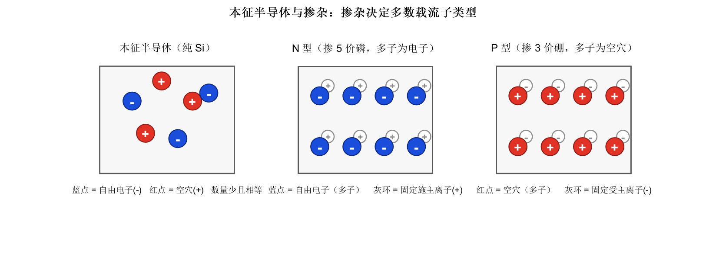

**N 型半导体（掺 5 价元素，如磷 P、砷 As）**

5 价杂质有 5 个价电子，与硅形成 4 个共价键后**多出 1 个电子**，这个电子极易挣脱成为自由电子。于是：

- **多数载流子（多子）= 电子**（带负电，N = Negative）
- 杂质原子失去电子后成为**固定的正离子**（图中灰环 ⊕，不能移动）
- 仍有极少量热激发产生的空穴，称为**少数载流子（少子）**

**P 型半导体（掺 3 价元素，如硼 B、镓 Ga）**

3 价杂质只有 3 个价电子，与硅成键时**缺 1 个电子**，相当于贡献了一个空穴。于是：

- **多数载流子（多子）= 空穴**（视为带正电，P = Positive）
- 杂质原子得到电子后成为**固定的负离子**（图中灰环 ⊖）
- 少数载流子是电子

> **关键澄清**：无论 N 型还是 P 型，整体仍然**电中性**——多子的电荷被固定的杂质离子电荷精确抵消。掺杂只是改变了"哪种载流子占多数、能自由移动"，并没有给材料整体带电。

掌握"多子/少子/固定离子"这三个角色，下一节 PN 结的全部行为都能推导出来。

---

### 3.2.3 PN 结的形成与内建电场

把一块 P 型和一块 N 型半导体"做"在一起（实际是在同一硅片上通过工艺形成），交界处就诞生了 **PN 结**——半导体器件的核心结构。

接触瞬间，一连串自动发生的物理过程：

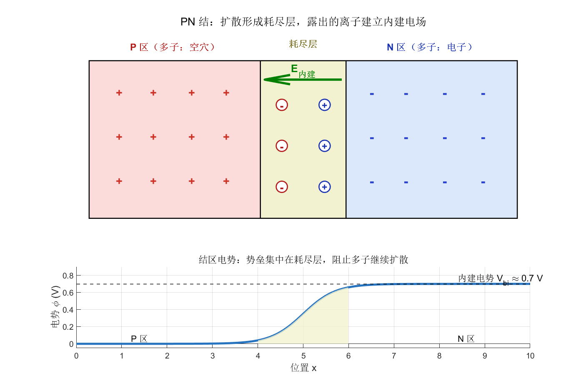

**① 扩散（Diffusion）**：N 区电子浓度高，会向 P 区扩散；P 区空穴浓度高，会向 N 区扩散。（这是浓度差驱动的自然行为，类似墨水在水中扩散。）

**② 形成耗尽层（Depletion Region）**：电子越过边界后与 P 区空穴复合而消失，空穴越过边界后与 N 区电子复合而消失。结果，交界处附近的可动载流子被"清空"，只剩下**不能移动的杂质离子**——P 侧露出负离子，N 侧露出正离子。这个没有可动载流子的区域称为耗尽层。

**③ 建立内建电场（Built-in Field）**：耗尽层里 P 侧负、N 侧正，形成一个由 N 指向 P 的**内建电场 $E_{内建}$**。这个电场对继续扩散的载流子施加反向阻力。

**④ 动态平衡**：扩散使载流子越界，内建电场把它们推回，当两种作用平衡时，扩散停止，耗尽层宽度稳定。此时耗尽层两端存在一个**内建电势差（势垒）$V_{bi}$**（硅约 0.6~0.7 V），如图下方曲线所示——它像一道"坎"，阻止多子进一步越界。

> **一句话抓住本质**：PN 结的平衡，是**浓度差驱动的扩散**与**内建电场驱动的漂移**之间的拉锯。这道由内建电场撑起的"势垒"，正是单向导电性的开关——外加电压无非是在升高或降低这道坎。

---

### 3.2.4 单向导电性：正偏与反偏

PN 结最重要的特性是**单向导电**。给它加上外部电压（偏置，Bias），坎的高低随之改变：

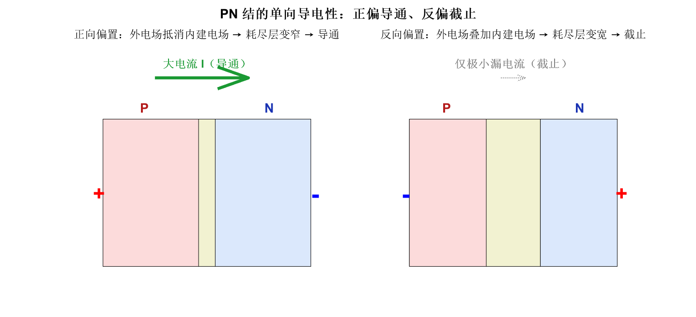

**正向偏置（Forward Bias）：P 接正、N 接负**

外加电场方向与内建电场相反，**削弱**了势垒，耗尽层变窄。当外加电压超过开启电压（硅约 0.7 V）时，势垒被大幅压低，多子能够大量越过结区——**形成大电流，二极管导通**。导通后电流随电压指数级增长。

**反向偏置（Reverse Bias）：P 接负、N 接正**

外加电场方向与内建电场相同，**增强**了势垒，耗尽层变宽。多子被进一步挡住，只剩极少量少子能漂移过结——**只有纳安到微安级的反向漏电流，二极管截止**。

> **直觉总结**：PN 结像一扇**单向阀门**。正偏时阀门被推开（导通），反偏时阀门被压得更紧（截止）。"P 高 N 低则通，反之则断"——这就是整流、检波、保护等无数应用的物理基础。

---

### 3.2.5 二极管的伏安特性（Shockley 方程）

把 PN 结封装成两端器件，就是**二极管（Diode）**。它的伏安特性由著名的 **Shockley 二极管方程**精确描述：

$$\boxed{I = I_s\left(e^{\,U/(nV_T)} - 1\right)}$$

各参数含义：

| 参数 | 含义 | 典型值 |
| ---- | ---- | ------ |
| $I_s$ | 反向饱和电流 | $10^{-12} \sim 10^{-9}$ A（硅） |
| $U$ | 二极管两端电压（正偏为正） | — |
| $n$ | 理想因子（1~2） | 硅 ≈ 1 |
| $V_T$ | 热电压 $kT/q$ | 室温（300 K）≈ 25.85 mV |

热电压 $V_T = kT/q$ 中，$k$ 是玻尔兹曼常数，$T$ 是绝对温度，$q$ 是电子电荷。室温下约 26 mV——这个数字值得记住，它频繁出现在半导体器件分析中。

把方程画出来，就是二极管的"身份证"：

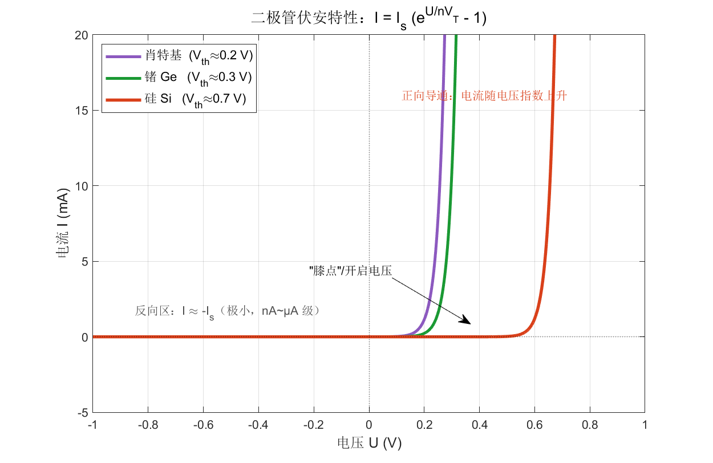

读图要点：

- **正向区**（$U > 0$）：电流随电压**指数上升**。存在一个明显的"膝点"（开启电压 $V_{th}$），超过它电流才迅速增大。硅约 0.7 V，锗约 0.3 V，肖特基约 0.2 V。
- **反向区**（$U < 0$）：指数项趋于 0，$I \approx -I_s$，是一个极小的负电流（图上几乎贴着横轴）。这就是反向漏电流。
- **强非线性**：与电阻的直线对比，这条曲线把"双向对称"彻底打破，成了单向导通——非线性正是功能之源。

> **不同材料为何膝点不同？** 开启电压本质上反映了导带与价带的能隙（带隙）和势垒高度。带隙越大，需要越高的外加电压才能压低势垒、让载流子越过。这也解释了为何后面 LED 中蓝光（高能光子）需要比红光更高的开启电压。

**工程上的简化模型**：精确的指数方程便于仿真，但手算时常用近似——

- **理想模型**：导通即 0 V 压降（开关）
- **恒压降模型**：导通时固定压降 0.7 V（硅），最常用
- **折线模型**：0.7 V 开启 + 一个小的串联电阻

选哪个取决于精度需求，这正是 3.1.5 节"负载线找交点"思想的实际应用。

---

### 3.2.6 反向击穿与温度特性

**反向击穿（Reverse Breakdown）**

反向电压加得过高时，反向电流会突然剧增——这叫击穿。机理有两种：

- **齐纳击穿（Zener）**：强电场直接把共价键中的电子拉出来，发生在低压（< 6 V）、重掺杂的结，温度系数为负
- **雪崩击穿（Avalanche）**：少子被强电场加速，碰撞电离出更多载流子，雪崩式倍增，发生在高压、轻掺杂的结，温度系数为正

普通二极管要**避免**击穿（可能烧毁）；但若把击穿控制在安全范围，反而能利用它做**稳压**——这就是下一节稳压二极管的原理。

**温度特性**

二极管对温度敏感，两条经验规律值得记住：

- 正向压降约以 **−2 mV/°C** 漂移（温度升高，同样电流下压降减小）——可用于温度传感
- 反向漏电流 $I_s$ 大约**每升温 10°C 翻一倍**——高温下漏电显著恶化

> 温度效应既是麻烦（电路参数漂移），也是资源（PN 结温度传感器、带隙基准源都建立在它之上）。这与 Chapter 2.1.4 提到的"温漂寄生调制"一脉相承。

---

> **3.2 节小结**
>
> | 概念 | 核心 |
> | ---- | ---- |
> | 半导体 | 导电能力可控；两种载流子：电子(−) 与空穴(+) |
> | 掺杂 | N 型多子为电子，P 型多子为空穴；整体仍电中性 |
> | PN 结 | 扩散→耗尽层→内建电场→动态平衡，形成势垒 $V_{bi}$ |
> | 单向导电 | 正偏削弱势垒→导通；反偏增强势垒→截止 |
> | 伏安特性 | $I = I_s(e^{U/nV_T}-1)$，指数非线性，膝点约 0.7 V（硅） |
> | 击穿/温度 | 齐纳/雪崩击穿可用于稳压；压降 −2 mV/°C，漏电随温升翻倍 |

---

## 3.3 现代常用电路元器件

有了基本定律（3.1）和半导体基础（3.2），现在系统过一遍工程中天天用到的元器件。每一个都从它的**伏安特性**切入——这是理解其行为最快的路径。

### 3.3.1 电阻器（Resistor）

电阻是最基础的无源元件，作用是**限制电流、分压、设定偏置、消耗能量**。其伏安特性就是 3.1.4 那条过原点的直线（$U = IR$），这里不再重画。

**关键参数**：阻值、功率额定（$P = I^2R$，超了会烧）、精度（±1%、±5%）、温度系数。

**几种特殊"非线性电阻"** 值得一提——它们的阻值随外界条件变化，伏安特性不再是直线：

| 类型 | 英文 | 阻值随什么变化 | 典型应用 |
| ---- | ---- | -------------- | -------- |
| 热敏电阻 | Thermistor（NTC/PTC） | 温度 | 测温、浪涌抑制、过温保护 |
| 光敏电阻 | LDR / Photoresistor | 光照强度 | 光控开关、自动调光 |
| 压敏电阻 | Varistor（MOV） | 两端电压（强非线性） | 浪涌/雷击防护（钳位过压） |
| 力敏电阻 | FSR | 压力 | 触摸、称重 |

> 这些"敏感电阻"是最简单的**传感器**——它们把物理量（温度、光、压力）转换成可测的电阻变化，恰好衔接 Chapter 1 "信号是物理量的变化"这一主题。

---

### 3.3.2 电容器（Capacitor）

电容由两个被绝缘介质隔开的导体极板构成，作用是**储存电荷、隔直流通交流、滤波、去耦**（去耦的应用已在 Chapter 2.2.1 详述）。

电容的核心关系**不是**一条静态伏安曲线，而是一个**微分关系**：

$$\boxed{i = C\,\frac{\mathrm{d}u}{\mathrm{d}t}}$$

电流由电压的**变化率**决定，而非电压本身。这一点和电阻有本质区别，必须建立新的直觉：

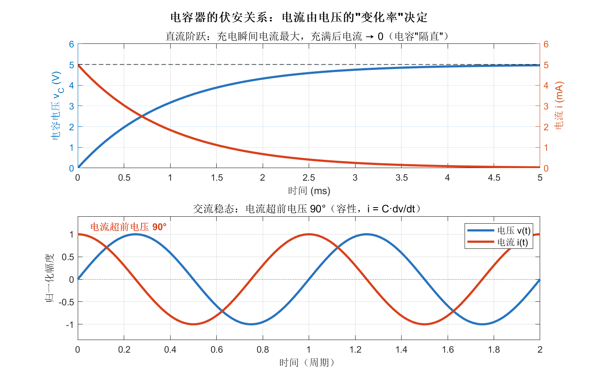

**上图（直流阶跃）**：突然加上 5 V 电压，充电瞬间电压变化最快，电流最大；随着电容充满（$u$ 趋于稳定，$\mathrm{d}u/\mathrm{d}t \to 0$），电流降为零。这就是"**电容隔直流**"——稳态下电容相当于开路。充放电的时间尺度由时间常数 $\tau = RC$ 决定。

**下图（交流稳态）**：施加正弦电压，电流超前电压 **90°**。因为电流正比于电压的导数，而 $\sin$ 的导数是 $\cos$，相位上领先 1/4 周期。

电容对交流呈现的**容抗**随频率升高而减小：

$$X_C = \frac{1}{2\pi f C}$$

> **为什么电容没有"伏安特性曲线"？** 因为它是**储能元件**，同一个电压可以对应任意电流（取决于电压在怎么变化）。它的 i-u 关系是动态的、有记忆的（取决于历史）。这正是 3.3.4 节要用 i-v 轨迹（椭圆）来刻画它的原因。

**主要类型**：陶瓷电容（MLCC，高频去耦首选）、电解电容（大容量、有极性）、钽电容（稳定、小体积）、薄膜电容（高精度、音频）。

---

### 3.3.3 电感器（Inductor）

电感通常是一段绕制的线圈，作用是**储存磁能、通直流阻交流、滤波、扼流**（磁珠、共模扼流圈已在 Chapter 2.2.4 出现）。

电感的核心关系与电容**对偶（互为镜像）**：

$$\boxed{u = L\,\frac{\mathrm{d}i}{\mathrm{d}t}}$$

这次是**电压**由**电流的变化率**决定。把电容的 $u$ 和 $i$ 对调，就得到电感——这种对偶性是理解 LC 电路的钥匙。

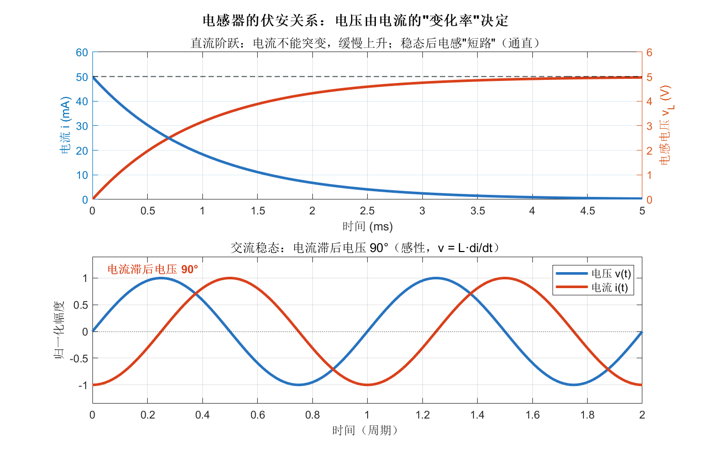

**上图（直流阶跃）**：电流不能突变（否则 $\mathrm{d}i/\mathrm{d}t$ 无穷大，电压无穷大），所以电流缓慢上升；电感两端电压则从最大值衰减。稳态后电流恒定，$u = 0$——这就是"**电感通直流**"，稳态下相当于短路。时间常数 $\tau = L/R$。

**下图（交流稳态）**：电流滞后电压 **90°**，恰好与电容相反。

电感对交流呈现的**感抗**随频率升高而增大（与电容相反）：

$$X_L = 2\pi f L$$

> **电感的"反抗变化"性格**：它总是反抗电流的变化（楞次定律）。电流想增大，它产生反向电压阻止；电流想减小（如开关断开瞬间），它产生高压维持电流——这就是继电器、电机断电时产生**感性尖峰**、需要加**续流二极管**保护的原因。

---

### 3.3.4 R / L / C 的统一视角：阻抗与 i-v 相位

把电阻、电容、电感放在一起，用一个统一框架——**阻抗（Impedance）**——来看，三者的关系豁然开朗。

| 元件 | 时域关系 | 阻抗 $Z$ | i 与 u 相位 | 能量 |
| ---- | -------- | -------- | ----------- | ---- |
| 电阻 R | $u = iR$ | $R$（实数） | 同相（0°） | 消耗（变热） |
| 电容 C | $i = C\,\mathrm{d}u/\mathrm{d}t$ | $\dfrac{1}{j\omega C}$ | 电流超前 90° | 储存（电场） |
| 电感 L | $u = L\,\mathrm{d}i/\mathrm{d}t$ | $j\omega L$ | 电流滞后 90° | 储存（磁场） |

其中 $\omega = 2\pi f$，$j$ 是虚数单位（呼应 Chapter 1.4 欧拉公式）。阻抗把电阻的概念推广到了交流：**实部是电阻（耗能），虚部是电抗（储能）**。

最能体现三者本质区别的，是它们的 **i-v 轨迹**（对正弦激励，画电流随电压变化的参数曲线）：

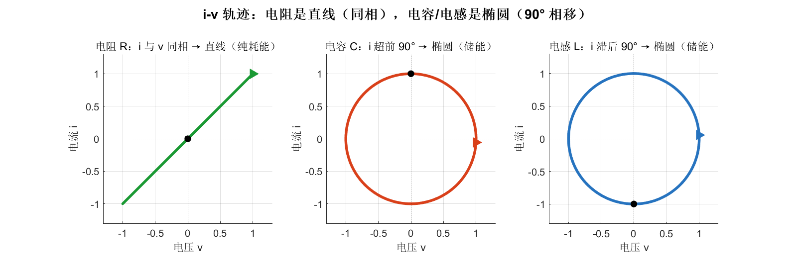

- **电阻**：i 与 u 同相，轨迹是一条**直线**——任意时刻电流唯一对应电压，纯耗能
- **电容/电感**：i 与 u 相差 90°，轨迹是**椭圆（圆）**——同一个电压对应两个不同电流（取决于在升还是在降），这正是"储能元件有记忆"的几何体现
- **电容与电感的椭圆旋转方向相反**——直观反映了"超前"与"滞后"的对偶

> **这张图回答了 3.3.2 的疑问**：为什么储能元件没有单值的伏安特性曲线？因为它的 i-u 关系是一个**回线（loop）**而非曲线。回线所围的面积，与每周期储存又释放的能量有关。理解了这一点，就抓住了电抗元件的本质。

LC 组合会产生**谐振**（$f_0 = 1/2\pi\sqrt{LC}$），这是滤波器、振荡器、阻抗匹配网络的基础，已在 Chapter 2.2.4 的 LC 滤波器中登场。

---

### 3.3.5 二极管家族

基于 3.2 的 PN 结，工程上衍生出一个庞大的二极管家族，各自利用了伏安特性的不同部分：

| 类型 | 利用的特性 | 典型用途 |
| ---- | ---------- | -------- |
| 整流二极管 | 正向导通、反向截止 | 把交流变直流（整流桥） |
| 肖特基二极管 | 开启电压低、恢复快 | 高频整流、低压防反接、开关电源 |
| 稳压（齐纳）二极管 | 反向击穿区电压恒定 | 电压基准、过压保护 |
| 发光二极管（LED） | 正向导通时复合发光 | 照明、显示、指示、光通信 |
| TVS 二极管 | 反向钳位响应极快 | 浪涌/静电（ESD）防护 |
| 变容二极管 | 反偏时结电容随电压变 | 压控振荡、调谐 |
| 光电二极管 | 反偏时光生载流子 | 光探测、太阳能电池 |

下面重点看两个伏安特性最有代表性的成员。

#### 稳压二极管（Zener Diode）

它**工作在反向击穿区**。一旦反向电压达到稳压值 $V_Z$，电流可以在很大范围变化，而两端电压几乎钉死在 $V_Z$：

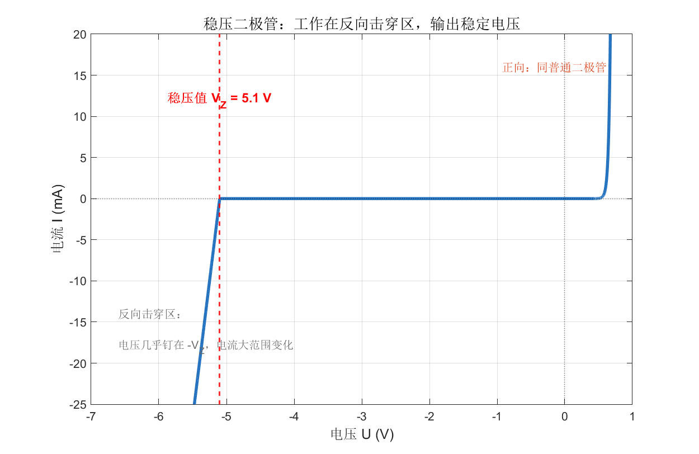

注意伏安特性反向部分那条**近乎垂直的线**——这正是"稳压"的几何含义：电流大幅变化（垂直方向），电压几乎不动（水平方向）。配一个限流电阻（又是负载线找交点！），就构成最简单的并联稳压电路。

> **应用直觉**：稳压管像一个"电压上限挡板"。负载电流波动时，它吸收多余电流，把电压死死压在 $V_Z$。但它效率低、精度一般，现代精密场合多用专用基准芯片或 LDO（见 Chapter 2.2.1）。

#### 发光二极管（LED）

正向导通时，电子与空穴在结区**复合**，把能量以光子形式释放——这就是发光。它的伏安特性与普通二极管同形（指数曲线），但**开启电压更高，且随发光颜色（光子能量）升高**：

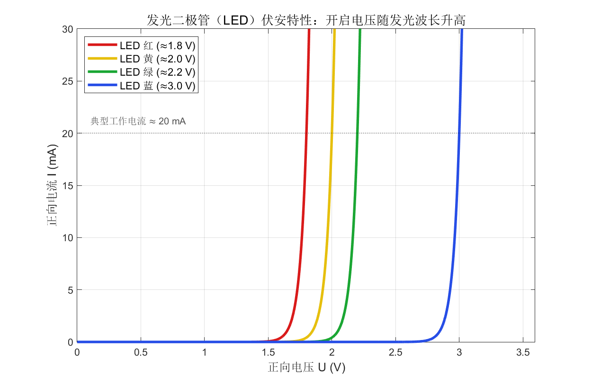

光子能量 $E = h\nu = hc/\lambda$，波长越短（越偏蓝）能量越高，需要越大的开启电压。这解释了红（≈1.8 V）→ 黄 → 绿 → 蓝（≈3.0 V）的递增规律，也是高效白光 LED 长期依赖"蓝光 LED + 荧光粉"路线的物理原因。

> **关键工程提示**：从伏安特性可见，LED 的曲线在膝点后**极其陡峭**——电压稍微升高一点，电流就暴增。因此 **LED 绝不能直接接电压源**，必须**串联限流电阻**或用**恒流驱动**，否则电流失控会瞬间烧毁。计算限流电阻：$R = (V_{源} - V_{LED})/I_{LED}$，例如 5 V 驱动红光 LED（1.8 V，20 mA）：$R = (5-1.8)/0.02 = 160\ \Omega$。

---

### 3.3.6 双极型晶体管（BJT）

晶体管是 20 世纪最伟大的发明之一，**放大**和**开关**功能让一切现代电子和计算成为可能。**双极型晶体管（BJT, Bipolar Junction Transistor）** 由两个 PN 结背靠背构成，有三个引脚：基极（B）、集电极（C）、发射极（E），分 NPN 和 PNP 两型。

BJT 的核心特性是**电流控制电流**：用一个微小的基极电流 $I_B$，去控制一个大得多的集电极电流 $I_C$：

$$I_C = \beta \, I_B$$

其中 $\beta$（电流放大倍数）通常 50~300。这就是放大的本质——四两拨千斤。

把 $I_C$ 随集电极-发射极电压 $V_{CE}$ 的变化，对不同 $I_B$ 画成一族曲线，就是 BJT 的**输出特性曲线**：

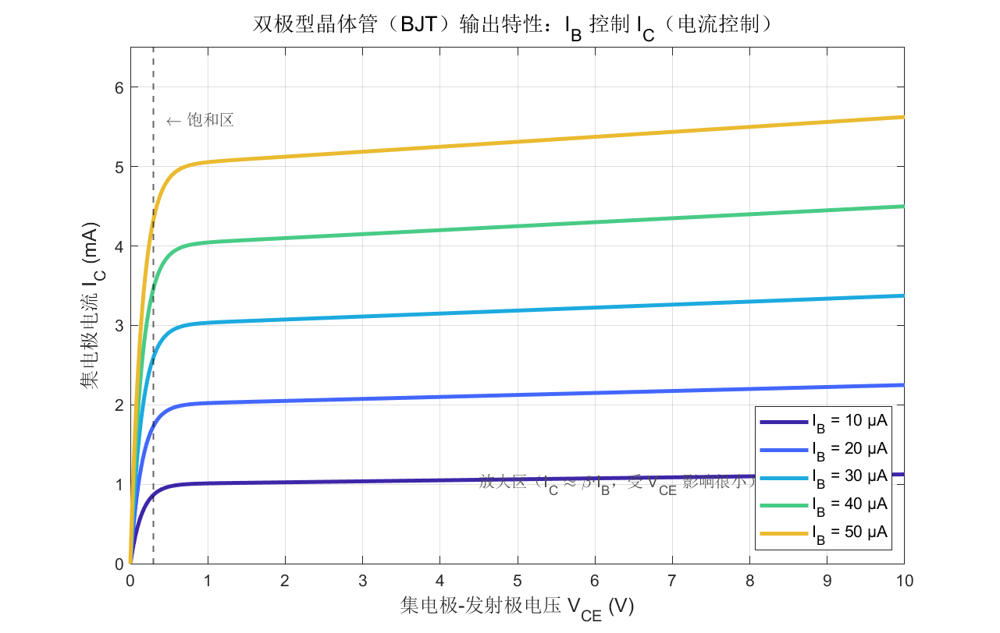

三个工作区，对应三种用途：

| 工作区 | 条件 | $I_C$ 行为 | 用途 |
| ------ | ---- | ---------- | ---- |
| 截止区 | $I_B = 0$ | $I_C \approx 0$ | 开关"关" |
| 放大区 | 适当偏置 | $I_C = \beta I_B$，几乎不随 $V_{CE}$ 变 | 线性放大（模拟） |
| 饱和区 | $V_{CE}$ 很小 | $I_C$ 不再增大 | 开关"开" |

读图：曲线在 $V_{CE}$ 很小时（饱和区）陡升，之后进入近乎水平的放大区——**水平**意味着"恒流"，$I_C$ 由 $I_B$ 决定而几乎不受 $V_{CE}$ 影响，这正是良好放大器的标志。曲线越往上对应的 $I_B$ 越大，体现了 $I_B$ 对 $I_C$ 的控制。

> **放大 vs 开关**：模拟电路（音频放大、传感器调理）让 BJT 工作在放大区；数字电路把它当开关用，在截止区和饱和区之间快速切换。Chapter 2.2.2 提到的 GPIO 推挽输出、逻辑门，底层都是晶体管开关。

---

### 3.3.7 场效应晶体管（MOSFET）

**MOSFET**（金属-氧化物-半导体场效应晶体管）是当今数字集成电路（CPU、存储器、手机 SoC）绝对的主力——一颗现代芯片里有几百亿个 MOSFET。三个引脚：栅极（G）、漏极（D）、源极（S）。

与 BJT 最根本的区别：MOSFET 是**电压控制电流**。栅极通过一层绝缘氧化层"隔空"控制沟道，**几乎不取栅极电流**——这意味着极低的静态功耗和极高的输入阻抗，正是它统治数字世界的原因。

MOSFET 有两条关键特性曲线：

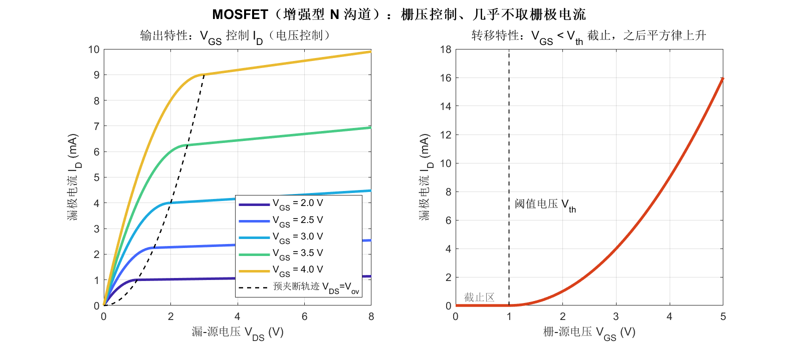

**左图——输出特性（$I_D$ ~ $V_{DS}$，以 $V_{GS}$ 为参数）**，分两个区：

- **可变电阻区（线性区）**：$V_{DS}$ 较小时，MOSFET 像一个受 $V_{GS}$ 控制的电阻，$I_D$ 随 $V_{DS}$ 上升——这是它做**开关**导通时的状态（导通电阻 $R_{DS(on)}$ 越小越好）
- **饱和区（恒流区）**：$V_{DS}$ 较大时，$I_D$ 趋于水平，由 $V_{GS}$ 决定——这是它做**放大**时的状态
- 图中虚线（预夹断轨迹 $V_{DS} = V_{GS} - V_{th}$）是两区的分界

**右图——转移特性（$I_D$ ~ $V_{GS}$）**：

- $V_{GS} < V_{th}$（阈值电压）：沟道未形成，**截止**，$I_D \approx 0$
- $V_{GS} > V_{th}$：$I_D$ 按**平方律**上升 $I_D \propto (V_{GS}-V_{th})^2$

> **BJT vs MOSFET——怎么选？**
>
> | 维度 | BJT | MOSFET |
> | ---- | --- | ------ |
> | 控制方式 | 电流控制（$I_B$） | 电压控制（$V_{GS}$） |
> | 输入阻抗 | 低（取基极电流） | 极高（栅极几乎不取流） |
> | 静态功耗 | 较高 | 极低 |
> | 开关速度 | 快 | 很快 |
> | 主战场 | 模拟、分立放大、低成本 | 数字 IC、电源开关、大功率 |
>
> 一句话：**数字与功率开关用 MOSFET，精密模拟与某些放大场合 BJT 仍有优势。** 现代 CMOS（互补 MOS）逻辑——N 沟道与 P 沟道 MOSFET 配对——之所以能做到几乎零静态功耗，正是利用了 MOSFET 栅极不取电流的特性。

---

### 3.3.8 元器件伏安特性一览

把本章出现的代表性元件的伏安特性放在一张图上对比，"形状即本质"的主线就一目了然：

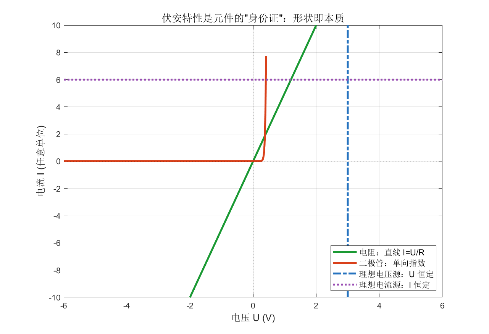

| 元件 | 伏安特性形状 | 本质 |
| ---- | ------------ | ---- |
| 电阻 | 过原点直线 | 线性、双向、耗能 |
| 二极管 | 单向指数曲线 | 非线性、单向导通 |
| 稳压管 | 反向有垂直击穿段 | 反向钳位稳压 |
| 理想电压源 | 垂直线（U 恒定） | 不论电流多大，电压不变 |
| 理想电流源 | 水平线（I 恒定） | 不论电压多大，电流不变 |
| 电容/电感 | 不是曲线而是 i-v 回线 | 储能、有记忆、相位 90° |

> **看懂伏安特性 = 看懂元件。** 一条直线、一条指数曲线、一段垂直击穿、一个椭圆回线——形状的差异，就是功能的差异。这是本章想留下的最核心的思维方式。

---

## 3.4 本章小结

本章从电路的物理地基一路搭到现代器件，三节层层递进：

| 层次 | 内容 | 核心收获 |
| ---- | ---- | -------- |
| 3.1 基本原理 | 基本物理量、欧姆定律、KCL/KVL、伏安特性 | 解任意电路 = KCL+KVL+各元件伏安特性 |
| 3.2 半导体与 PN 结 | 掺杂、PN 结、单向导电、Shockley 方程 | 非线性（功能之源）来自半导体物理 |
| 3.3 常用元器件 | R/L/C、二极管家族、BJT、MOSFET | 每个元件的行为 = 它的伏安特性形状 |

**贯穿全章的两条主线**：

1. **伏安特性是元件的身份证**——直线（电阻）、指数曲线（二极管）、受控曲线族（晶体管）、i-v 回线（电容/电感），形状决定功能。
2. **非线性是器件智能的来源**——线性元件只能搬运能量，正是 PN 结带来的非线性，才造就了整流、稳压、放大、开关，进而堆叠出整个数字与模拟电子世界。

至此，前三章构成了一个完整的认知链条：

```text
Chapter 1：信号是什么（信息的载体、噪声、特征、傅里叶）
        ↓
Chapter 2：信号在哪里流动（PCB 电路、电源/接地、空中的电磁波）
        ↓
Chapter 3：信号被什么加工（基本定律、PN 结、元器件的伏安特性）
```

理解了元器件层面"信号如何被产生与加工"，我们就具备了从系统视角讨论更复杂主题的基础——例如放大器设计、电源管理、数模混合系统，以及它们与信号完整性、电磁兼容的相互作用。
